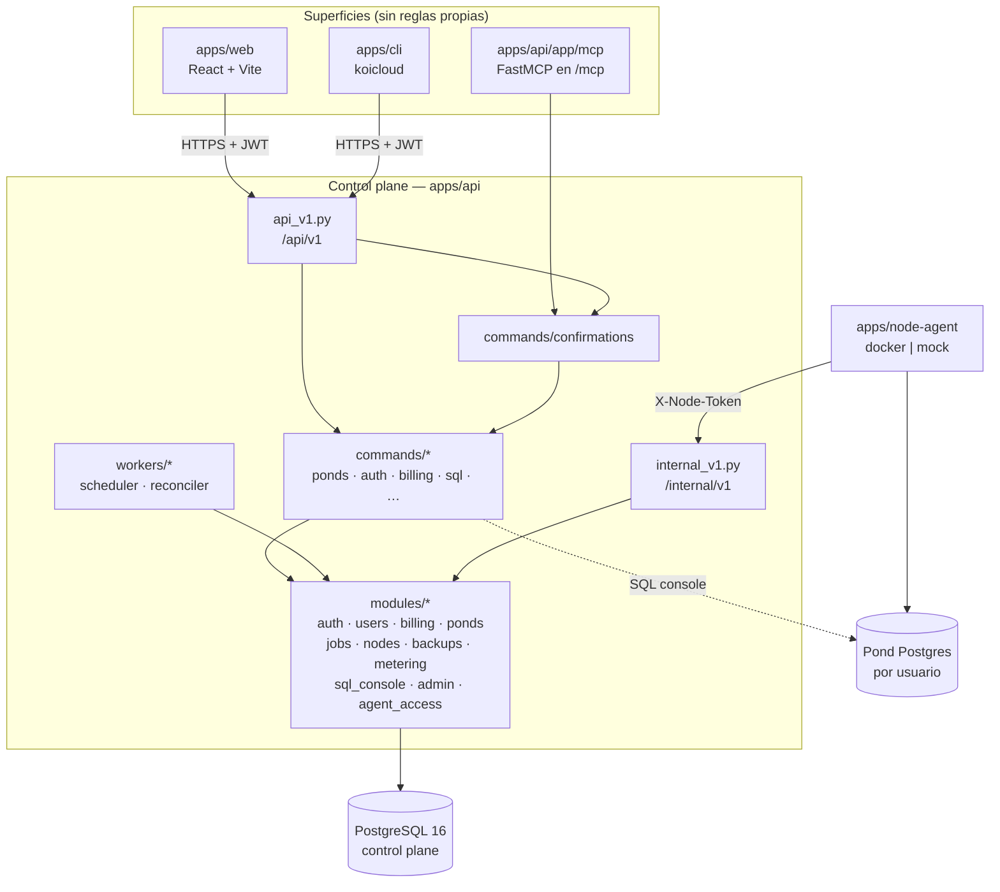

# KoiCloud — Arquitectura (resumen para agentes y entrega)

**Proyecto:** KoiCloud · DBaaS académico (PostgreSQL en Docker)  
**Curso:** Ingeniería de Software I · Universidad Rafael Landívar · 2026  
**Equipo:** Hugo Escobar · Jason Gutiérrez · Jousé Menendez · Diego Joachin

Este documento resume **cómo se comporta el sistema hoy**, derivado del código en `apps/` y del pack sellado en `docs/architecture/`. Para contratos HTTP, tablas y diagramas detallados, usa ese pack; este archivo es la puerta de entrada.

> **Mantenimiento:** cualquier PR que cambie comportamiento observable (flujos, estados, superficies, límites de confianza) debe actualizar este archivo en el mismo PR.

---

## Comportamiento en una página

1. **Un solo cerebro.** Web, CLI y MCP no implementan reglas de negocio. Llaman a `/api/v1/*` (o al montaje MCP); la API delega en `app/commands/*`, que orquesta módulos en `app/modules/*` y persiste en PostgreSQL.
2. **Control plane vs data plane.** La API nunca ejecuta `docker` directamente. Escribe estado deseado, encola jobs (`FOR UPDATE SKIP LOCKED` en la misma base) y el **node-agent** (`apps/node-agent`) materializa ponds con `docker_driver` o `mock_driver`.
3. **Estado en PostgreSQL.** Usuarios, ponds, jobs, facturación simulada, confirmaciones pendientes, acceso de agente y auditoría mínima viven en la base interna. Sin estado significativo en memoria entre requests.
4. **Superficies.** La Web usa JWT en cookie/header. CLI y MCP usan JWT; las mutaciones remotas pasan por **`propose → confirmation_token → confirm`** (409 con `summary` en español, token de 5 minutos).
5. **Consola SQL.** Conexión efímera al puerto público del pond del usuario (`asyncpg`), read-only por defecto; SQL write exige confirmación en CLI/MCP.
6. **Un solo nodo.** No hay HA ni multi-VPS en alcance. El reconciler del worker es best-effort, no SLA.

---

## Módulos y flujo de datos

**Lectura del diagrama:**

| Paso | Qué pasa |
|------|----------|
| Crear pond (Web) | `POST /api/v1/ponds` → `create_pond` → fila en `ponds` + job `provision` → node-agent `claim` → `docker run` → heartbeat actualiza `observed` |
| Mutar (CLI/MCP) | Primera llamada → `409 confirmation_required` + token; `POST /confirm/{token}` ejecuta el comando |
| Respaldos | Worker agenda backup diario; restore encola job y pasa por confirmación en superficies no-Web |
| Facturación | Planes y suscripciones en `billing`; pago simulado; PDF de factura con IVA |
| Admin | Rutas bajo dependencia `get_admin_user`; listados de usuarios/ponds/auditoría |

---

## Mapa de código (real en el repo)

| Ruta | Rol |
|------|-----|
| `apps/api/app/main.py` | App FastAPI, montaje MCP, health |
| `apps/api/app/api_v1.py` | Router HTTP público (contrato OpenAPI) |
| `apps/api/app/commands/` | Punto único de reglas (`create_pond`, `run_sql`, `subscribe`, …) |
| `apps/api/app/modules/` | Dominio por carpeta: `router` fino → `service` → SQLAlchemy |
| `apps/api/app/core/` | Config, DB, auth JWT, errores `AppError`, enums |
| `apps/api/alembic/` | Migraciones (solo W1) |
| `apps/api/app/mcp/` | Tools MCP (lectura; mutantes vía confirm) |
| `apps/node-agent/` | Claim/complete jobs, drivers Docker/mock |
| `apps/web/src/api/` | Cliente tipado + hooks TanStack Query |
| `packages/contracts/openapi.json` | Generado con `make contracts` |

No existe módulo `tenancy/`: el aislamiento es **por usuario** (JWT + ownership de ponds en comandos) y **gate MCP** (`agent_access`: slug + password por usuario).

---

## Documentación relacionada

| Documento | Contenido |
|-----------|-----------|
| [`docs/architecture/README.md`](architecture/README.md) | Índice del pack de diseño |
| [`docs/architecture/system-architecture.md`](architecture/system-architecture.md) | Topología y principios |
| [`docs/architecture/api-surface.md`](architecture/api-surface.md) | Rutas REST y catálogo de errores |
| [`docs/architecture/data-model.md`](architecture/data-model.md) | Tablas, enums, máquinas de estado |
| [`docs/architecture/interconnections.md`](architecture/interconnections.md) | Secuencias de flujos |
| [`AGENTS.md`](../AGENTS.md) | Reglas de trabajo para agentes de IA |
| [`README.md`](../README.md) | Primeros comandos y estructura del monorepo |
