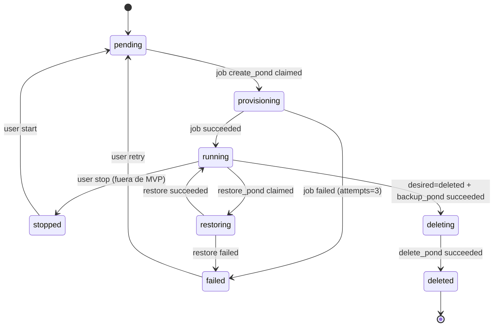
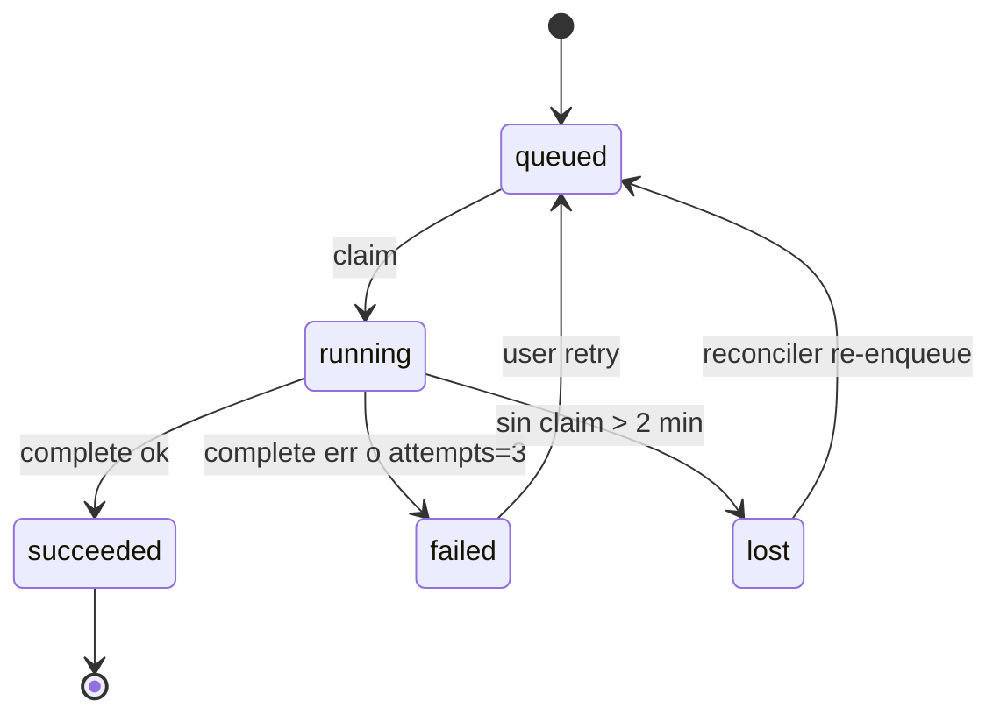
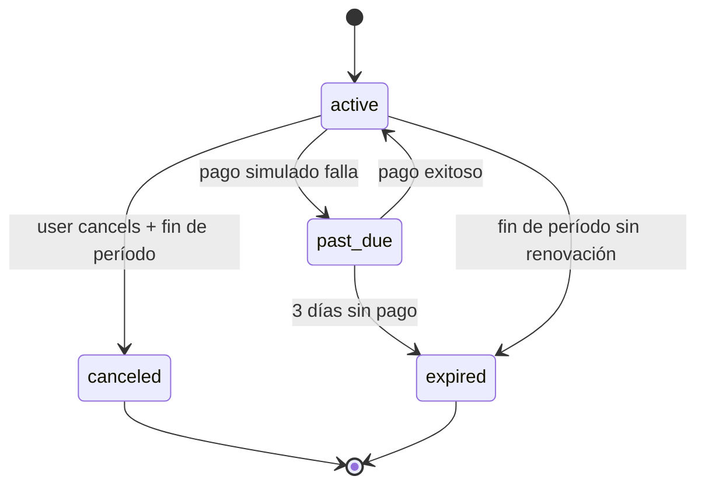

# Modelo de datos

Refinamiento del ER de la Entrega 2 ([`../entrega-2/diagramas/06-modelo-er.mmd`](../entrega-2/diagramas/06-modelo-er.mmd)) alineado al alcance sellado. Este documento es la fuente única de tablas, columnas, enums y máquinas de estado. Cualquier cambio pasa por CCR (§9 de [`agent-docs.md`](./agent-docs.md)).

Convenciones:

- Nombres en `snake_case`; identificadores en inglés.
- `id` = `UUID` v4 excepto los catálogos (`plans.id` es `text` tipo slug).
- Timestamps con zona (`timestamptz`), en UTC.
- Estados en enums nativos de Postgres (más rápidos, chequeo en DB).
- **PII mínima:** solo email, nombre, NIT opcional.

---

## 1. Vista ER completa

```mermaid
erDiagram
    users ||--o{ email_tokens : "issues"
    users ||--o{ refresh_tokens : "keeps"
    users ||--o{ subscriptions : "contracts"
    users ||--o{ ponds : "owns"
    users ||--o{ invoices : "receives"
    users ||--o{ payments : "makes"
    users ||--o| agent_access : "gate_demo"
    users ||--o{ pending_confirmations : "proposes"
    users ||--o{ sql_history : "queries"
    users ||--o{ audit_events : "acts"
    plans ||--o{ subscriptions : "defines"
    plans ||--o{ ponds : "sizes"
    subscriptions ||--o{ invoices : "bills"
    invoices ||--o{ invoice_lines : "contains"
    invoices ||--o{ payments : "settles"
    nodes ||--o{ ponds : "hosts"
    nodes ||--o{ jobs : "runs"
    ponds ||--|| pond_status : "observed_as"
    ponds ||--o{ jobs : "target"
    ponds ||--o{ backups : "has"
    ponds ||--o{ pond_samples : "measured_by"
    ponds ||--o{ usage_daily : "aggregated"
    ponds ||--o{ sql_history : "queried"

    users {
      uuid id PK
      citext email UK
      text password_hash
      text full_name
      user_role role
      text nit
      user_status status
      timestamptz email_verified_at
      timestamptz created_at
    }
    email_tokens {
      uuid id PK
      uuid user_id FK
      email_token_kind kind
      text token_hash UK
      timestamptz expires_at
      timestamptz consumed_at
    }
    refresh_tokens {
      uuid id PK
      uuid user_id FK
      text token_hash UK
      timestamptz expires_at
      timestamptz revoked_at
    }
    plans {
      text id PK
      text name
      text description
      numeric price_monthly_usd
      int max_ponds
      int max_storage_gb
      int validity_minutes
      boolean postpaid
      boolean active
    }
    subscriptions {
      uuid id PK
      uuid user_id FK
      text plan_id FK
      subscription_status status
      timestamptz current_period_start
      timestamptz current_period_end
      boolean cancel_at_period_end
    }
    invoices {
      uuid id PK
      text number UK
      uuid user_id FK
      uuid subscription_id FK
      numeric subtotal_usd
      numeric iva_usd
      numeric total_usd
      invoice_status status
      timestamptz issued_at
      text pdf_path
    }
    invoice_lines {
      uuid id PK
      uuid invoice_id FK
      text description
      numeric amount_usd
    }
    payments {
      uuid id PK
      uuid invoice_id FK
      numeric amount_usd
      payment_status status
      text method
      text provider
      text provider_ref
      timestamptz processed_at
    }
    nodes {
      text id PK
      text public_host
      node_status status
      int capacity_ponds
      timestamptz last_seen_at
      text token_hash
    }
    ponds {
      uuid id PK
      uuid user_id FK
      text plan_id FK
      text node_id FK
      text name
      text engine_version
      pond_desired_state desired_state
      int host_port
      text db_password_encrypted
      timestamptz created_at
      timestamptz last_restore_at
    }
    pond_status {
      uuid pond_id PK
      pond_observed_state observed_state
      boolean healthy
      text last_error
      timestamptz last_seen_at
      timestamptz updated_at
    }
    jobs {
      uuid id PK
      job_type type
      uuid pond_id FK
      text node_id FK
      job_status status
      jsonb payload
      int attempts
      timestamptz claimed_at
      timestamptz created_at
      timestamptz completed_at
      text last_error
    }
    backups {
      uuid id PK
      uuid pond_id FK
      backup_kind kind
      backup_status status
      text storage_path
      bigint size_bytes
      text sha256
      timestamptz created_at
      timestamptz completed_at
    }
    pond_samples {
      uuid id PK
      uuid pond_id FK
      bigint size_bytes
      text container_state
      timestamptz sampled_at
    }
    usage_daily {
      uuid pond_id PK
      date day PK
      numeric instance_hours
      numeric storage_gb_hours
    }
    sql_history {
      uuid id PK
      uuid user_id FK
      uuid pond_id FK
      text query_truncated
      sql_mode mode
      int row_count
      int duration_ms
      timestamptz executed_at
    }
    agent_access {
      uuid id PK
      uuid user_id FK
      text access_slug UK
      text password_hash
      boolean enabled
      timestamptz rotated_at
      timestamptz created_at
    }
    pending_confirmations {
      uuid id PK
      uuid user_id FK
      text token_hash UK
      text action
      jsonb payload
      text summary
      timestamptz expires_at
      timestamptz consumed_at
    }
    audit_events {
      uuid id PK
      uuid actor_user_id FK
      text actor_kind
      text target_kind
      uuid target_id
      text action
      jsonb metadata
      timestamptz at
    }
```



Cambios respecto a la Entrega 2:

- `users.status` (`active | suspended`) explícito para el admin (E8-03).
- `pending_confirmations.summary` (texto humano) añadido para que CLI/MCP muestren el resumen sin recomputar.
- `jobs.attempts`, `jobs.last_error`, `jobs.claimed_at`, `jobs.completed_at` — necesarios para el reconciler mínimo.
- `backups.sha256`, `backups.size_bytes` — para auditoría del respaldo.
- `sql_history.mode` (`read | write`) explícito.
- `audit_events` mínimo (solo acciones sensibles: `suspend_user`, `reveal_agent_access`, `delete_pond`, `restore_backup`).

---

## 2. Enums (tipos nativos)

```sql
CREATE TYPE user_role AS ENUM ('client','admin');
CREATE TYPE user_status AS ENUM ('active','suspended');
CREATE TYPE email_token_kind AS ENUM ('verify_email','reset_password');

CREATE TYPE subscription_status AS ENUM ('pending_payment','active','canceled','expired','past_due');
CREATE TYPE invoice_status AS ENUM ('issued','paid','void');
CREATE TYPE payment_status AS ENUM ('succeeded','failed','pending');

CREATE TYPE node_status AS ENUM ('alive','draining','dead');
CREATE TYPE pond_desired_state AS ENUM ('running','stopped','deleted');
CREATE TYPE pond_observed_state AS ENUM (
  'pending','provisioning','running','stopped','restoring','deleting','deleted','failed'
);

CREATE TYPE job_type AS ENUM (
  'create_pond','start_pond','stop_pond','delete_pond','backup_pond','restore_pond'
);
CREATE TYPE job_status AS ENUM ('queued','running','succeeded','failed','lost');
CREATE TYPE backup_kind AS ENUM ('daily','on_demand','pre_delete');
CREATE TYPE backup_status AS ENUM ('queued','running','succeeded','failed');
CREATE TYPE sql_mode AS ENUM ('read','write');
```

---

## 3. Restricciones e índices críticos

```sql
-- Unicidad de nombre de pond por usuario
CREATE UNIQUE INDEX ponds_user_name_uk ON ponds (user_id, name)
  WHERE desired_state <> 'deleted';

-- Un solo job activo por pond
CREATE UNIQUE INDEX jobs_one_active
  ON jobs (pond_id) WHERE status IN ('queued','running');

-- Índice para la cola
CREATE INDEX jobs_queue
  ON jobs (status, created_at) WHERE status = 'queued';

-- Índice para el reconciler
CREATE INDEX jobs_lost_scan
  ON jobs (status, claimed_at) WHERE status = 'running';

-- Rate limit / conteo por usuario en la última hora
CREATE INDEX pending_conf_user_recent
  ON pending_confirmations (user_id, expires_at);

-- Un slug por agent_access
CREATE UNIQUE INDEX agent_access_slug_uk ON agent_access (access_slug);

-- Historial SQL con paginación
CREATE INDEX sql_history_user_time ON sql_history (user_id, executed_at DESC);

-- Muestras por pond y tiempo
CREATE INDEX pond_samples_pond_time ON pond_samples (pond_id, sampled_at DESC);

-- Un provider_ref único por proveedor de pago (CCR #66)
CREATE UNIQUE INDEX payments_provider_ref_ix ON payments (provider, provider_ref);
```

Reglas de integridad relevantes:

- `ponds.node_id` es `NOT NULL` (siempre asignado al crear).
- `ponds.host_port` es `NOT NULL` y `UNIQUE` (un puerto = un pond).
- `pond_status` está atado 1-1 a `ponds` (se crea junto en la misma transacción).
- `invoices.number` es único a nivel global (`KC-{year}-{seq:06d}`).
- `refresh_tokens` almacena solo el hash; nunca el valor.

---

## 4. Máquinas de estado

### 4.1 Pond (deseado × observado)



- `desired_state` es lo que el usuario pidió (`running` o `deleted` en MVP; `stopped` deja huella para el futuro pero no expone endpoint).
- `observed_state` lo cambia el node-agent al completar jobs y en cada heartbeat.
- El reconciler NO cambia estados; **encola jobs**.

### 4.2 Job



- `attempts` empieza en 0; `lost → queued` aumenta `attempts` en 1.
- Después de 3 intentos fallidos: `failed` definitivo hasta intervención humana.

### 4.3 Suscripción



### 4.4 Backup y confirmación

- `backups.status`: `queued → running → succeeded | failed`.
- `pending_confirmations`: sin estado; simplemente `expires_at`, `consumed_at`. Se limpia con purga diaria (>= 24 h).

---

## 5. Semillas (obligatorias en `0002_seed_plans`)

```python
plans = [
    {
        "id": "sandbox",
        "name": "Sandbox",
        "description": "Pruebas internas (10 min)",
        "price_monthly_usd": 0,
        "max_ponds": 1,
        "max_storage_gb": 1,
        "validity_minutes": 10,
        "postpaid": False,
        "active": True,
    },
    {
        "id": "micro",
        "name": "Micro",
        "description": "1 pond, 1 GB, backups 7 días",
        "price_monthly_usd": 5.0,
        "max_ponds": 1,
        "max_storage_gb": 1,
        "validity_minutes": 30 * 24 * 60,
        "postpaid": False,
        "active": True,
    },
    {
        "id": "pro",
        "name": "Pro",
        "description": "Hasta 10 ponds, post-pago por uso",
        "price_monthly_usd": 0,
        "max_ponds": 10,
        "max_storage_gb": 20,
        "validity_minutes": 30 * 24 * 60,
        "postpaid": True,
        "active": True,
    },
]
```

Los precios y descripciones deben coincidir con los del catálogo público ([`../propuesta-koicloud.md`](../propuesta-koicloud.md) §3). Cambios pasan por CCR.

---

## 6. PII y secretos en la base

| Dato | Ubicación | Tratamiento |
|------|-----------|-------------|
| Password de usuario | `users.password_hash` | Argon2id (cost por defecto de `argon2-cffi`) |
| Refresh token | `refresh_tokens.token_hash` | SHA-256 del valor emitido |
| Token de email / reset | `email_tokens.token_hash` | SHA-256 |
| Confirmation token (CLI/MCP) | `pending_confirmations.token_hash` | SHA-256 |
| Password de pond | `ponds.db_password_encrypted` | Cifrado con Fernet (`POND_PASSWORD_KEY`) |
| Password de agent gate | `agent_access.password_hash` | Argon2id |
| Token del node | `nodes.token_hash` | SHA-256 |

**Nunca** se guarda el valor plano de un token/password. Los valores en claro solo existen:

- El del pond, en el objeto `PondConnectionOut` cuando el usuario pide su URI.
- El del agente, en la respuesta a `POST /agent-access/rotate` (una sola vez).
- Los tokens de email/reset/confirmation, en el email enviado o en la respuesta de propose (idem, una sola vez).

---

## 7. Estrategia de migraciones

- **Alembic lineal**, una sola cabeza (`alembic heads == 1` verificado en CI).
- Cada migración toca **un cambio lógico** (`0001_initial`, `0002_seed_plans`, `0003_add_sql_history`, …). Nada de “migración monstruo”.
- Nombres: `NNNN_<slug>.py` con 4 dígitos zero-padded (`0001`, `0002`, …).
- Solo W1 crea/edita migraciones; el resto pide CCR.
- Migraciones **no** se rescriben una vez fusionadas. Un error se corrige con una migración nueva.
- **Datos semilla** (`plans`) van en migraciones separadas para poder desplegar features sin re-semilla.
- Data migrations (transformación de datos existentes) se documentan al detalle en el docstring de la migración y se prueban contra dump de dev.

**Rollback:** en producción, `alembic downgrade` es una acción manual guiada por runbook `docs/runbooks/rollback-migration.md`. El deploy no revierte automáticamente.

**Convención de nombres SQL:**

- Índices: `<tabla>_<columnas>_idx` (o `_uk`, `_fk`).
- Constraints: `<tabla>_<constraint>_ck`.
- Enums: `<nombre_singular>` (`pond_desired_state`, no `pond_desired_states`).

---

## 8. Vistas SQL útiles (documentales, no obligatorias en MVP)

Estas vistas se documentan aquí como candidatas para admin/uso; su creación es opcional y solo se agregan si simplifican queries repetidas:

- `active_subscriptions` = subs `status='active'` con `current_period_end > now()`.
- `ponds_view` = join `ponds + pond_status + latest_job + plan` para la lista del panel.
- `usage_monthly` = agregación de `usage_daily` por mes/pond.

Ninguna es requisito de release.

---

## 9. Tablas explícitamente NO en este modelo

Aunque el harness previo o el instinto de agentes podría sugerirlas, **no** existen en MVP:

- `organizations`, `memberships`, `org_users` — no hay teams.
- `api_keys`, `agent_keys` con scopes — `agent_access` (uno por usuario) es todo.
- `approvals` (workflow humano-aprueba-bot) — sustituido por `pending_confirmations`.
- `budgets`, `agent_spend` — sin spend caps.
- `incidents`, `uptime_checks` — sin status page.
- `usage_events` finos (por request) — solo `pond_samples` + `usage_daily`.
- `feature_flags`, `experiments`, `ab_tests` — no aplican.
- Tablas de organizaciones/proyectos/entornos — planos: usuario → suscripción → pond.

Si un agente insiste en agregar una, la respuesta es `BLOQUEADO: requiere CCR (fuera de alcance sellado)`.
