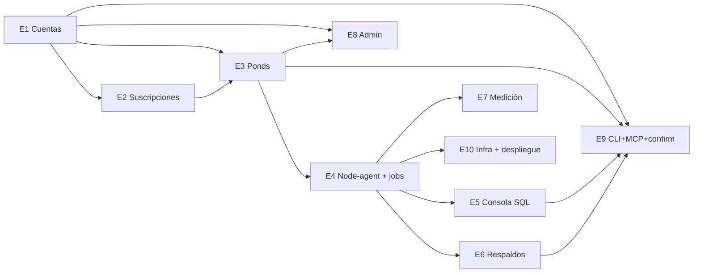

# Feature breakdown

Mapa completo de funcionalidades del alcance sellado, agrupadas en épicas, con dependencias y un orden de construcción sugerido. La regla del semestre es cruda: **si la demo no lo necesita, no se construye ahora**. El orden preserva el camino corto a un MVP demostrable.

---

## 1. Épicas y funcionalidades

Cada funcionalidad tiene ID estable `E<épica>-<n>`. La columna “Superficie” indica dónde se muestra al usuario (Web / CLI / MCP / Admin). El backend responsable siempre está detrás en la API — “superficie” describe canales, no ubicación de reglas.

### E1 — Cuentas y sesiones (dueño principal: W3)

| ID | Feature | Superficie | Notas |
|----|---------|-----------|-------|
| E1-01 | Registro con correo + contraseña + nombre + NIT opcional | Web | Argon2id; correo de bienvenida con enlace de verificación (24 h) |
| E1-02 | Verificación de correo por token de un solo uso | Web | Endpoint `POST /auth/verify?token=…`; expira 24 h |
| E1-03 | Login con JWT (15 min) + refresh (30 días) | Web, CLI | Refresh rotativo; revocación por hash |
| E1-04 | Recuperación de contraseña por token temporal | Web | 1 h de vida; usa mismo canal de correo |
| E1-05 | Perfil (nombre, NIT) | Web | Requerido para factura |
| E1-06 | Rol Administrador con ruta separada `/admin/*` | Web | Bit `role=admin` en JWT; guard en frontend + backend |

### E2 — Catálogo, suscripciones y facturación simulada (W3)

| ID | Feature | Superficie | Notas |
|----|---------|-----------|-------|
| E2-01 | Catálogo público de planes (Sandbox, Micro, Pro) | Web | Semilla en migración `0002_seed_plans` |
| E2-02 | Contratación con pago simulado | Web | `POST /billing/subscribe` → crea `subscriptions` + `invoice` + `payment(simulated)` |
| E2-03 | Historial de pagos y descarga de factura PDF con IVA | Web | PDF con `fpdf2`; IVA 12 % desglosado |
| E2-04 | Renovación automática al fin de período | Worker (scheduler) | Solo tarea diaria; genera invoice + payment |
| E2-05 | Cancelación por el usuario (fin de período) | Web, CLI (mutación con confirm) | Marca `cancel_at_period_end=true`; comando `koicloud subscription cancel` |
| E2-06 | Vista de historial de suscripciones activas y pasadas | Web | — |

### E3 — Provisioning de ponds (W1 + W3 para cuota)

| ID | Feature | Superficie | Notas |
|----|---------|-----------|-------|
| E3-01 | Crear pond (nombre + plan heredado + versión 16) | Web, CLI (confirm), MCP (confirm) | `POST /ponds` → INSERT desired=running + job `create_pond` |
| E3-02 | Ver lista de ponds del usuario | Web, CLI, MCP | Estado observado (last heartbeat) |
| E3-03 | Ver detalle: estado, host, puerto, uri, contraseña | Web, CLI, MCP | Password enmascarado; endpoint `reveal` protegido |
| E3-04 | Eliminar pond | Web (modal “escribe el nombre”), CLI (confirm), MCP (confirm) | `DELETE /ponds/{id}` → desired=deleted + job `delete_pond`; siempre encola `backup_pond` previo |
| E3-05 | Estado derivado (`provisioning`, `running`, `stopping`, `deleting`, `failed`, …) | Web, CLI, MCP | Máquina de estados en `ponds/service.py` |
| E3-06 | Cuotas por plan (`max_ponds` del plan del usuario) | Backend | Validación al crear; devuelve `quota_exceeded` |

### E4 — Node-agent y ciclo de jobs (W1)

| ID | Feature | Superficie | Notas |
|----|---------|-----------|-------|
| E4-01 | node-agent con drivers `mock` y `docker` | — (interno) | `AGENT_MODE` decide en runtime |
| E4-02 | Heartbeat cada 15 s con estado de contenedores | — | Actualiza `pond_status.last_seen_at` + `observed_state` |
| E4-03 | Cola de jobs con `FOR UPDATE SKIP LOCKED` | — | Índice único parcial `(pond_id) WHERE status IN ('queued','running')` |
| E4-04 | Handlers de jobs: `create_pond`, `delete_pond`, `backup_pond`, `restore_pond`, `start_pond`, `stop_pond` | — | Un archivo por handler |
| E4-05 | Reconciler mínimo cada 30 s | Worker | Reencola job si `desired ≠ observed` y no hay job activo; **no vendido como auto-heal** |
| E4-06 | Endpoint interno `/internal/v1/*` (jobs, heartbeats, samples) | — | Auth con `X-Node-Token`; Caddy limita a loopback |

### E5 — Consola SQL (W4 UI + W4 backend)

| ID | Feature | Superficie | Notas |
|----|---------|-----------|-------|
| E5-01 | Ejecutar SELECT sobre un pond desde la web | Web | Editor CodeMirror; `statement_timeout=10s`; `SET TRANSACTION READ ONLY`; tope 1000 filas |
| E5-02 | Ejecutar SELECT desde la CLI | CLI | `koicloud sql run --pond <name> --query "…"`; imprime tabla |
| E5-03 | Ejecutar SELECT desde MCP | MCP | Tool `run_sql` — read por defecto, sin confirmación |
| E5-04 | Ejecutar sentencia write (INSERT/UPDATE/DELETE/DDL) | Web (modal + confirm), CLI (confirm), MCP (confirm) | Backend detecta write por parse ligero + banderilla; usa `pending_confirmations` en CLI/MCP |
| E5-05 | Historial de consultas del usuario | Web | `sql_history` truncada a 4000 chars |

### E6 — Respaldos (W1)

| ID | Feature | Superficie | Notas |
|----|---------|-----------|-------|
| E6-01 | Respaldo diario programado por pond | Worker | Job `backup_pond` encolado por scheduler diario |
| E6-02 | Restauración bajo demanda desde un respaldo | Web, CLI (confirm), MCP (confirm) | Job `restore_pond`; drop + recreate schema del pond |
| E6-03 | Listar respaldos disponibles por pond | Web, CLI, MCP | `GET /ponds/{id}/backups` |
| E6-04 | Respaldo pre-delete (siempre) | — | El `delete_pond` encola primero `backup_pond` con `kind=pre_delete` |

### E7 — Medición y uso (W1)

| ID | Feature | Superficie | Notas |
|----|---------|-----------|-------|
| E7-01 | Muestras periódicas del agent (pond size en bytes) | — | `pond_samples` cada 5 min |
| E7-02 | Agregación diaria en `usage_daily` (instance_hours + storage_gb_hours) | Worker | Tarea nocturna |
| E7-03 | Vista de uso mensual por pond y total | Web | — |
| E7-04 | Endpoint de uso CLI/MCP | CLI, MCP | Lectura; sin confirmación |

### E8 — Administración (W3)

| ID | Feature | Superficie | Notas |
|----|---------|-----------|-------|
| E8-01 | Listar usuarios con suscripción activa | Admin (Web) | Paginado |
| E8-02 | Listar todos los ponds del sistema | Admin (Web) | Filtro por usuario/estado |
| E8-03 | Suspender / reactivar usuario | Admin (Web, confirm) | Bloquea login y sesión activa; no borra datos |
| E8-04 | Ver bitácora básica (últimas N acciones sensibles) | Admin (Web) | Tabla `audit_events` sencilla |

### E9 — Superficies CLI + MCP + confirmaciones (W4 + W1)

| ID | Feature | Superficie | Notas |
|----|---------|-----------|-------|
| E9-01 | CLI `koicloud` publicable con `pip install -e apps/cli` | CLI | Typer; comandos `login`, `pond …`, `sql …`, `subscription …`, `backup …`, `agent …`, `confirm` |
| E9-02 | Servidor MCP montado en `/mcp` (FastMCP) | MCP | Tools: `whoami`, `list_ponds`, `get_pond`, `create_pond` (propose), `delete_pond` (propose), `run_sql` (read directo, write propose), `list_subscriptions`, `confirm_action(token)` |
| E9-03 | Endpoint `/mcp` protegido por URL secreta + password por usuario | — | Slug + argon2 hash en `agent_access` |
| E9-04 | `pending_confirmations` con token, resumen humano, expiración 5 min | — | `POST /confirm/{token}` consume |
| E9-05 | Panel “Acceso agente” en Web: revelar URL, generar/rotar password | Web | Ver [`api-surface.md`](./api-surface.md) §Acceso agente |
| E9-06 | Guion de demo MCP happy-path documentado | Docs | En `docs/manual-usuario/demo-mcp.md` y en `risks-and-demo-plan.md` |
| E9-07 | Fallback de demo: replay determinista de la conversación MCP sin LLM | Script | `scripts/demo-mcp-replay.py` (W4) |

### E10 — Infra, despliegue, operación (W4 + W1)

| ID | Feature | Superficie | Notas |
|----|---------|-----------|-------|
| E10-01 | `docker-compose.yml` dev con mock por defecto | — | `make up` |
| E10-02 | `infra/docker-compose.prod.yml` + Caddy + systemd unit del node-agent | — | Fase 0 base, refinamiento en S2 |
| E10-03 | Workflow `deploy.yml` (push a main → ssh VPS) | — | Verifica `GET /health` tras deploy |
| E10-04 | Pruebas k6 mínimas (login, list_ponds, create_pond) | — | S4 |
| E10-05 | Manual técnico + manual de usuario + reporte de carga | Docs | Última semana |

**Total ítems del alcance:** 55 features en 10 épicas. Nada más entra sin CCR.

---

## 2. Dependencias entre épicas

**Lectura:** primero cuentas y suscripciones habilitan crear ponds; los ponds requieren el ciclo de jobs; consola/backups/medición cuelgan del ciclo. CLI+MCP se construyen tarde (S3/S4) porque son adaptadores — se implementan cuando la API a la que llaman ya funciona.

---

## 3. Ruta al MVP demostrable (camino corto)

Este es el subconjunto **mínimo** que hay que tener para la demo. Cualquier otra cosa se recorta antes que este camino.

1. **Fase 0:** scaffold, CI, migración `0001`, OpenAPI con stubs, driver `mock` del agente.
2. **Corta:** E1-01 → E1-03 → E2-01 → E2-02 → E3-01 → E4-01…E4-04 → E3-02 → E3-03. Con esto ya hay Web + backend que crea un pond real y muestra su URI.
3. **Wow:** E9-01 (CLI mínimo con `pond list/get`) → E9-04 (confirmaciones) → E9-02 (MCP tools básicos) → E9-05 (panel de acceso agente en Web) → E9-06 (guion).
4. **Solidez de demo:** E5-01 (consola SQL read) → E6-01 (respaldo diario, aunque sea mock en dev) → E7-03 (vista de uso, aunque sea aproximada).
5. **Cierre:** E8-01…E8-03 (admin básico), E10-05 (manuales).

Todo lo que no está en esta lista es refuerzo, no MVP.

---

## 4. Orden por sprints (calendario indicativo, no calendario cerrado)

Los sprints se alinean con hitos del curso (ver `../propuesta-koicloud.md` §7). El orden importa; las fechas son referencia del equipo.

| Sprint | Fase | Objetivo demostrable al final | Features nuevas comprometidas |
|--------|------|-------------------------------|-------------------------------|
| **S0** (Fase 0) | Cimientos | `docker compose up` verde; CI verde; `POST /health` responde; migración `0001` aplica; OpenAPI generado; mock agent reclama y completa un job simulado | Scaffold; E4-01 (mock); E4-06 (skeleton); E10-01 |
| **S2** (Avance 30 %) | Camino crítico | Un usuario se registra, verifica correo, contrata Micro, crea un pond real en Docker y se conecta con `psql` local | E1-01, E1-02, E1-03, E1-05, E2-01, E2-02, E3-01, E3-02, E3-03, E4-02, E4-03, E4-04 (create/delete), E10-02 primera versión |
| **S3** (Avance 50 %) | Medición y billing | Factura PDF con IVA; renovación diaria; respaldos diarios; restore bajo demanda; vista de uso; reconciler mínimo | E2-03, E2-04, E2-05, E2-06, E3-04 (delete real + backup pre-delete), E3-05, E3-06, E4-05, E6-01, E6-02, E6-03, E6-04, E7-01, E7-02, E7-03 |
| **S4** (Avance 80 %) | Superficies y consola | Consola SQL Web + CLI + MCP (read); MCP con URL+password + `pending_confirmations`; CLI con confirm; admin | E5-01, E5-02, E5-03, E5-04, E5-05, E7-04, E8-01, E8-02, E8-03, E9-01, E9-02, E9-03, E9-04, E9-05, E10-03, E10-04 |
| **S5** (Entrega final) | Robustez y demo | Guion de demo ensayado; fallback determinista; k6 aprobado; manuales completos; ADRs cerrados | E8-04, E9-06, E9-07, E10-05, deuda técnica |

---

## 5. Reparto por workstream (recordatorio)

Detalle vive en [`repo-scaffolding.md`](./repo-scaffolding.md) §8 (CODEOWNERS). Esta tabla resume las épicas por dueño principal:

| Workstream | Persona | Épicas donde manda | Épicas donde apoya |
|------------|---------|---------------------|--------------------|
| W1 — Núcleo & data plane | Hugo | E3 (backend), E4, E6, E7, E10 (infra base) | E5 (backend `commands.run_sql`), E9 (patrón `pending_confirmations`), CI |
| W2 — Web | Persona B | Todas las pantallas de E1, E2, E3, E5, E6, E7, E8, E9 (paneles) | — |
| W3 — Cuentas y dinero | Persona C | E1, E2, E8 (backend) | E3 (cuotas) |
| W4 — Superficies y operación | Persona D | E5 (backend), E9 (CLI, MCP, guion), E10 (deploy, k6, manuales) | E7 (endpoint), infra |

Fase 0 la hace W1 en solitario porque toca todo el scaffold; a partir de S2 los cuatro trabajan en paralelo con `mock`/stubs entre dependencias no listas.

**Para W2, dos fuentes distintas por pantalla:** la **arquitectura de información** (qué campos, qué tablas, qué pasos) sale de los mockups de [`../entrega-2/mockups/pantallas-principales.html`](../entrega-2/mockups/pantallas-principales.html) y de las notas de cada feature de §1; la **piel** (color, tipografía, densidad, movimiento) sale de [`../visual-guidelines.md`](../visual-guidelines.md), que incluye en §10 la decisión visual pantalla por pantalla. El tema oscuro de los mockups no se traslada al producto.

---

## 6. Definition of Done (por feature, resumen)

Aplica a cualquier feature de esta lista; detalle por superficie en [`agent-docs.md`](./agent-docs.md) §DoD.

1. PR fusionado en `main` por squash con **CI verde** y **revisor automático `APPROVE`**.
2. Los criterios de aceptación del ticket están escritos y verificados uno por uno en el PR.
3. Pruebas: al menos una prueba de API por endpoint nuevo; al menos una prueba unitaria por regla de negocio; en frontend, prueba de render + interacción; en node-agent, prueba con `mock_driver`.
4. Caso feliz ejecutado a mano en `docker compose up` por el dueño y descrito en el PR (comando + salida esperada).
5. OpenAPI y `schema.d.ts` regenerados si el contrato cambió (solo con CCR).
6. Documentación tocada: docstring del módulo, `docs/architecture/` si el cambio altera arquitectura, `docs/manual-usuario/` si toca UI final.
   En pantallas, además: lista de verificación de piel de [`../visual-guidelines.md`](../visual-guidelines.md) §11.2 marcada en el PR.
7. Sin advertencias nuevas de ruff/mypy/eslint.

---

## 8. Qué se recorta si el semestre se atrasa

En este orden (primero se corta lo de arriba):

1. **E7-04** (uso por CLI/MCP): la Web ya muestra uso; CLI/MCP pueden vivir sin.
2. **E5-04** en MCP (SQL write vía MCP): dejarlo solo en Web y CLI.
3. **E6-02** en MCP y CLI: dejar restore solo en Web.
4. **E8-04** (bitácora): mostrarlo como “roadmap” en el manual.
5. **E2-04** (renovación diaria): dejar renovación manual desde admin.
6. **E10-04** (k6): sustituir por prueba manual documentada.

**Lo que nunca se recorta:** E1-01…E1-03, E2-01, E2-02, E3-01…E3-04, E4-01…E4-04, E5-01, E6-01 (aunque sea mock), E9-01…E9-06, E10-01, E10-02. Ese es el corazón demostrable.

---

## 7. Errores comunes que agentes proponen y cómo se rechazan

| Propuesta “tentadora” | Respuesta |
|-----------------------|-----------|
| “Agrego OAuth 2.1 para el MCP mientras estoy en agent_access” | **Fuera de alcance.** Gate mínima + confirm es lo comprometido |
| “Aprovecho para hacer schema explorer en la consola SQL” | **Fuera de alcance.** Feature solo si sobra tiempo, con CCR |
| “Reemplazo la cola por Redis Streams” | **Fuera de alcance.** Rompe R-04 |
| “Agrego métricas Prometheus + Grafana” | **Fuera de alcance.** Ni siquiera hay status page pública |
| “Migro a Next.js para SSR” | **Fuera de alcance.** SPA es suficiente y equipo ya sabe React+Vite |
| “Uso Kubernetes en el VPS aunque sea con k3s” | **Fuera de alcance.** El curso valora entender el provisioning |

Cualquier PR que introduzca una de estas se marca `REQUEST_CHANGES` sin discusión de mérito técnico.
