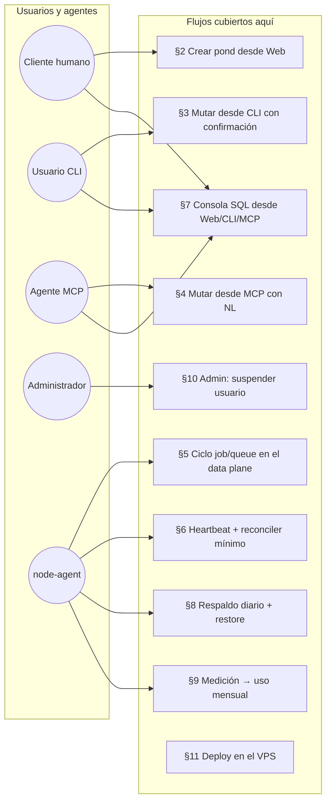
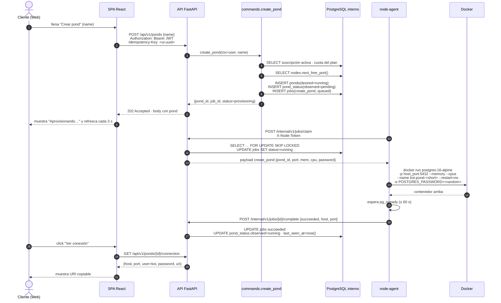
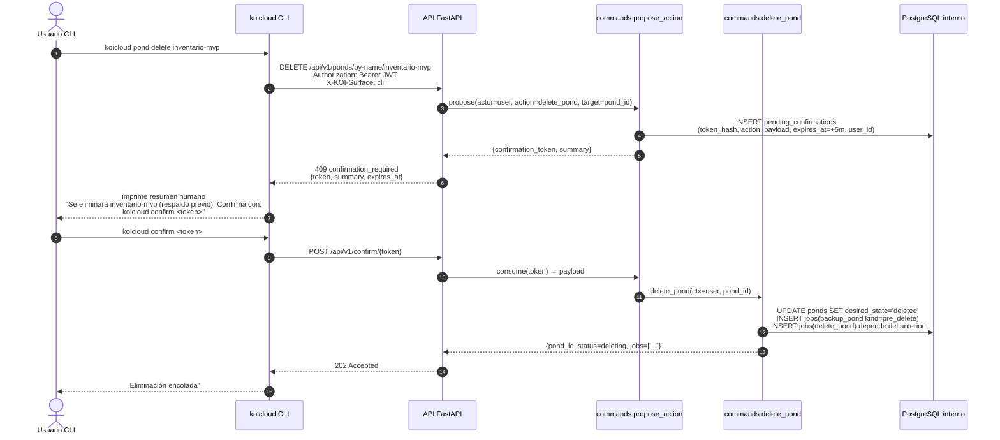
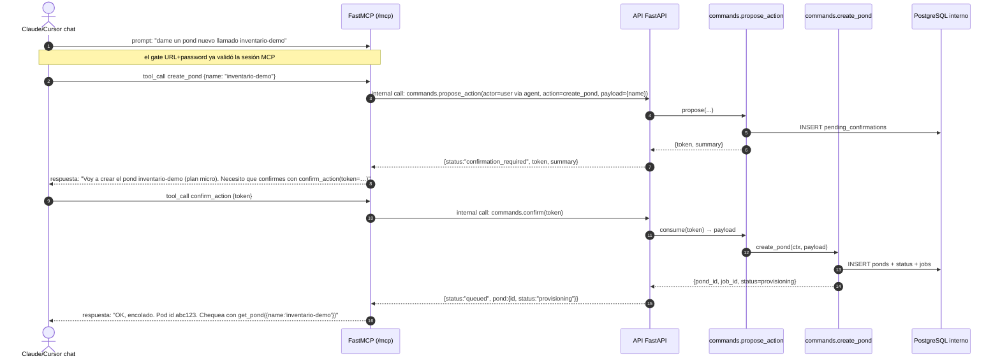
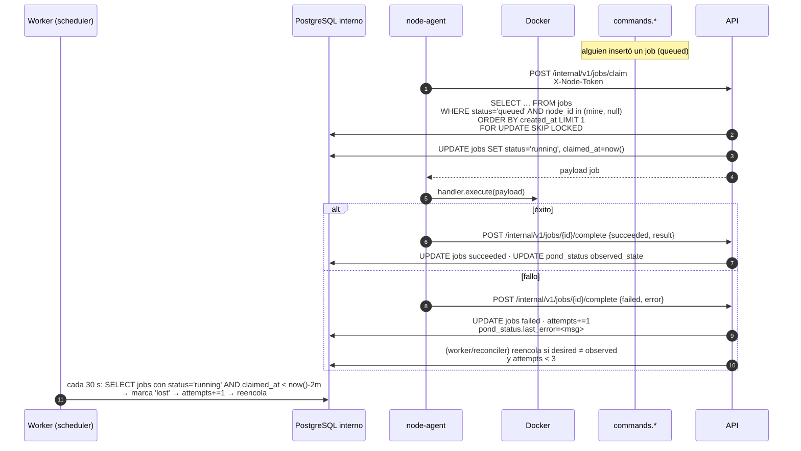
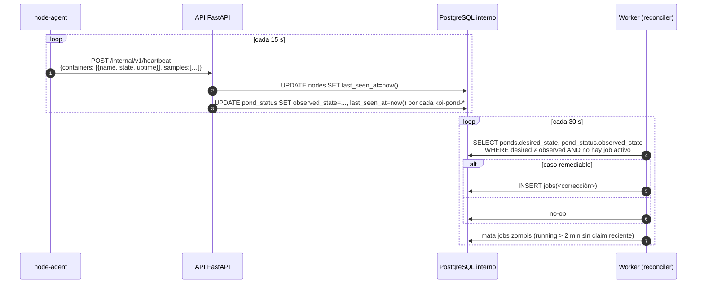
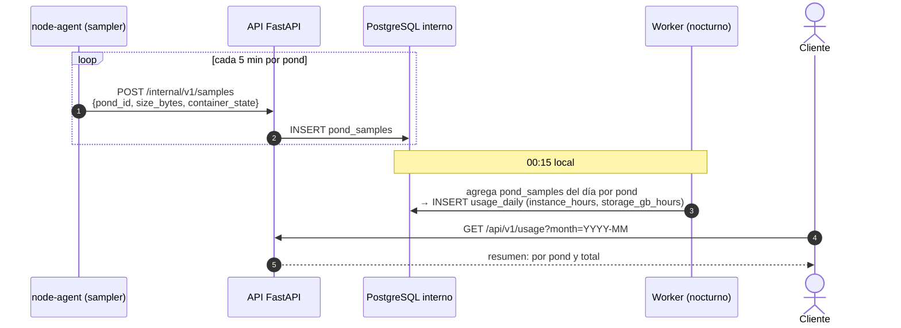
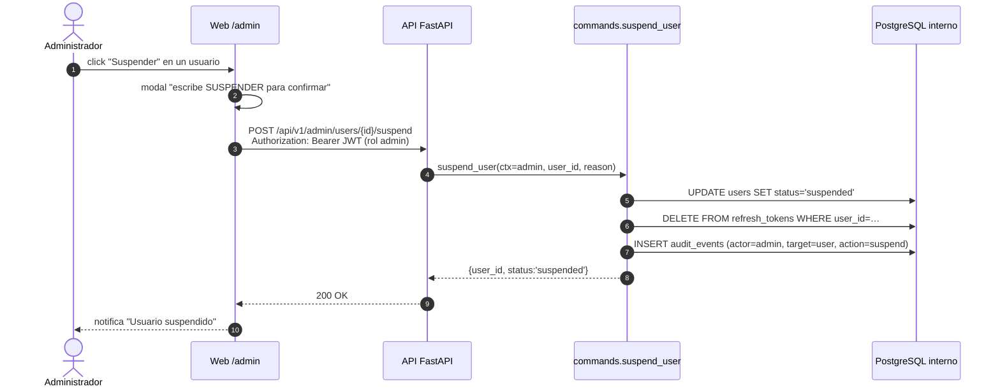
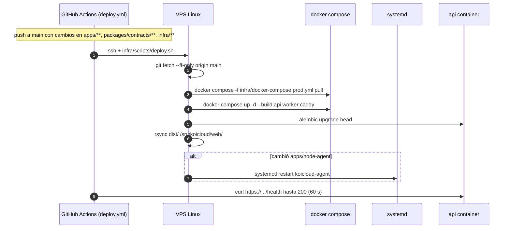

# Interconexiones — flujos concretos

Este documento describe *cómo* interactúan los componentes de KoiCloud en los escenarios que un examinador (o un teammate nuevo) pediría ver primero. Los diagramas están embebidos como Mermaid; las fuentes también existen en [`diagrams/`](./diagrams/).

Los componentes y sus contratos ya están fijados en [`system-architecture.md`](./system-architecture.md) y [`api-surface.md`](./api-surface.md). Aquí solo se muestra la coreografía.

---

## 1. Mapa general de flujos



Cada sección siguiente entrega el diagrama de secuencia y la lista de artefactos que cambian (registros SQL, archivos, jobs).

---

## 2. Crear pond desde la Web

**Actores:** Cliente humano, API, `commands.create_pond`, BD interna, node-agent, Docker.



**Cambios de estado esperados:**

| Momento | `ponds.desired_state` | `pond_status.observed_state` | `jobs(create_pond).status` |
|---------|------------------------|-------------------------------|-----------------------------|
| Post-INSERT | `running` | `pending` | `queued` |
| Post-claim | `running` | `pending` | `running` |
| Post-complete | `running` | `running` | `succeeded` |

**Errores clásicos:**

- `plan_required` (401 no; **409 conflict**): usuario sin suscripción activa.
- `quota_exceeded` (409): supera `max_ponds` del plan.
- `node_unavailable` (503): sin nodo `alive` para hospedar. En un solo nodo, ocurre si el node-agent no envió heartbeat en > 60 s.

---

## 3. CLI: mutación con doble confirmación

**Escenario:** el usuario quiere eliminar `inventario-mvp` desde su terminal.



**Notas:**

- El header `X-KOI-Surface: cli` (opcional) fuerza el modo confirmar; sin él, la API detecta mutación y siempre exige confirm salvo cuando el request incluye `X-KOI-Confirm-Token: <token>` directamente en un solo paso (útil para scripts).
- `koicloud confirm <token>` es un comando genérico; funciona para cualquier acción propuesta.
- Alternativa scriptable: `koicloud pond delete inventario-mvp --yes` que dispara el propose y consume el token en la misma sesión (dos requests HTTP, un solo comando).

---

## 4. MCP: NL → tools → confirm

**Escenario:** en Claude Desktop, el usuario escribe “dame un pond nuevo llamado `inventario-demo`”.



**Reglas de diseño MCP:**

- Toda tool mutante devuelve `{status:"confirmation_required", token, summary}` en su primera invocación; el LLM debe leer el `summary` y decidir si presenta el resumen al humano.
- El **prompt sistema** que se envía al LLM cliente (definido en el server MCP) le explica que:
  1. Nunca invente el token.
  2. Muestre el `summary` al humano antes de sugerir `confirm_action`.
  3. Trate `read_only=true` en tools como `list_ponds` y `run_sql (SELECT)` para no pedir confirmación innecesaria.
- El fallback determinista (§7 de [`risks-and-demo-plan.md`](./risks-and-demo-plan.md)) reproduce esta conversación con un cliente MCP local sin modelo.

---

## 5. Ciclo job/queue en el data plane

Vista general del bucle que sostiene toda operación con contenedores.



**Invariantes:**

- Un pond tiene a lo sumo **un job activo** (`queued` + `running`). Se hace cumplir con:
  ```sql
  CREATE UNIQUE INDEX jobs_one_active
    ON jobs (pond_id) WHERE status IN ('queued','running');
  ```
- `attempts` topa en 3; después el job queda `failed` y el reconciler no lo reintenta hasta intervención humana (`POST /api/v1/ponds/{id}/retry`).
- El scheduler diario **crea** jobs (respaldos, cierres de facturación); nunca los ejecuta.

---

## 6. Heartbeat + reconciler mínimo



**Alcance real del reconciler:**

- **Sí hace:** reintenta `create_pond` si el node-agent muere durante el arranque; reencola `start_pond` si el observado quedó `stopped` con `desired=running`; libera jobs `lost`.
- **No hace:** simular caos, matar y revivir automáticamente contenedores por gracia, medir uptime público, ni presumir SLA de recuperación. La demo no muestra `docker kill` como feature.

---

## 7. Consola SQL desde Web, CLI y MCP

**Camino común:** todos pasan por `commands.run_sql(ctx, pond_id, query, mode)`.

```mermaid
sequenceDiagram
    autonumber
    actor U as Usuario (Web/CLI/MCP)
    participant CLIENT as Adaptador (SPA / CLI / tool MCP)
    participant API as API FastAPI
    participant CMD as commands.run_sql
    participant PG as PostgreSQL del pond
    participant DB as PostgreSQL interno

    U->>CLIENT: escribe SELECT o UPDATE
    alt lectura
        CLIENT->>API: POST /api/v1/ponds/{id}/sql {query, mode:"read"}
    else escritura
        CLIENT->>API: POST /api/v1/ponds/{id}/sql {query, mode:"write"}<br/>(desde CLI/MCP → primero propose → confirm)
    end
    API->>CMD: run_sql(ctx, pond_id, query, mode)
    CMD->>DB: SELECT connection info (uri desencriptada)
    CMD->>PG: BEGIN;<br/>SET statement_timeout=10s;<br/>alt mode==read: SET TRANSACTION READ ONLY end;<br/>execute(query)
    PG-->>CMD: filas / row_count
    CMD->>PG: COMMIT o ROLLBACK
    CMD->>DB: INSERT sql_history (user, pond, query truncada, duration, rows, mode)
    CMD-->>API: {columns, rows[≤1000], row_count, duration_ms}
    API-->>CLIENT: respuesta
    CLIENT-->>U: tabla + duración
```

**Reglas:**

- **Web:** SELECT y UPDATE se muestran igual, pero para UPDATE la Web pide una confirmación local (modal “escribe el nombre del pond”). No usa `pending_confirmations` porque el usuario está en el navegador y el dueño de la sesión ya es él.
- **CLI y MCP:** cualquier query `mode="write"` **exige** `pending_confirmations` en dos pasos. El detector de modo va en la CLI/MCP (parse ligero) y también en el backend (defensa en profundidad: si un cliente jura “read” y la query es un `DELETE`, la API lo rechaza).
- **Conexión efímera:** `asyncpg.connect()` por consulta; sin pool persistente hacia ponds (evita contaminación de sesión entre requests).
- **Tope de filas:** el resultado se trunca a 1000 filas y se marca `truncated=true` en la respuesta.

---

## 8. Respaldo diario + restore

```mermaid
sequenceDiagram
    autonumber
    participant SCH as Worker (scheduler diario 02:00 local)
    participant DB as PostgreSQL interno
    participant NA as node-agent
    participant PG as PostgreSQL del pond
    participant FS as /var/lib/koicloud/backups
    actor U as Cliente (opcional)
    participant CMD as commands.restore_backup

    loop por cada pond activo
        SCH->>DB: INSERT jobs(backup_pond kind=daily, pond_id)
    end

    NA->>API: claim → payload backup_pond
    NA->>PG: pg_dump -Fc -f <tmp>
    NA->>FS: mv <tmp> /backups/<pond>/YYYYMMDD.dump
    NA->>API: complete succeeded {path, size}
    API->>DB: INSERT backups (pond_id, kind=daily, path, size, sha256)

    Note over U,CMD: Restore bajo demanda
    U->>API: POST /api/v1/ponds/{id}/restore {backup_id}<br/>(Web: modal · CLI/MCP: propose+confirm)
    API->>CMD: restore_backup(ctx, backup_id)
    CMD->>DB: INSERT jobs(restore_pond kind=on_demand, backup_id)
    NA->>API: claim → payload restore_pond
    NA->>PG: DROP SCHEMA app CASCADE;<br/>pg_restore -c -d app <backup.dump>
    NA->>API: complete succeeded
    API->>DB: UPDATE ponds.last_restore_at
```

**Notas:**

- Backups viven en disco local del VPS con retención definida (30 días para daily, ilimitado para `pre_delete` hasta compactar manualmente).
- El drop + restore borra datos actuales; en Web se pide confirmación tipando el nombre del pond, en CLI/MCP se aplica `pending_confirmations`.
- `sha256` del dump se registra al completar para auditoría mínima.

---

## 9. Medición → uso mensual



**Precisiones:**

- `instance_hours` se calcula como suma de intervalos en que `container_state = running`. Si el agente pierde muestras (caído), la ventana perdida se toma como `running` (asunción documentada) para no penalizar al usuario por fallos nuestros.
- `storage_gb_hours` es el promedio de `size_bytes` en el día × 24h. Es una estimación, no una métrica de billing real.
- No se factura en el semestre; la vista se muestra como demostración.

---

## 10. Admin: suspender usuario



**Efecto:**

- El usuario pierde sesión inmediata; próximo login recibe `403 account_suspended`.
- Sus ponds **no** se eliminan (evita destrucción irreversible por error de admin); el reconciler no los toca. El pond queda accesible por su URI pero no puede aprovisionar más.

---

## 11. Deploy en el VPS



**Reglas operativas:**

- El deploy es idempotente: si el mismo commit se despliega dos veces, no rompe nada.
- `alembic upgrade head` **no** se revierte automáticamente. Si una migración es incompatible, el deploy queda en `500` en `/health` y el equipo interviene con `alembic downgrade` manual guiado por runbook.
- El reinicio del node-agent es raro; solo cuando cambió su código. El systemd unit ya trae `Restart=on-failure` con `RestartSec=5`.

---

## 12. Vista consolidada: quién habla con quién

| Origen | Destino | Canal | Auth | Frecuencia típica |
|--------|---------|-------|------|-------------------|
| Web SPA | API `/api/v1/*` | HTTPS JSON | JWT | por interacción |
| CLI | API `/api/v1/*` | HTTPS JSON | JWT | por comando |
| IDE MCP | API `/mcp` | Streamable HTTP MCP | URL slug + password (Basic) | por conversación |
| API/MCP | commands | in-process | — | cada request |
| commands | modules | in-process | — | cada request |
| commands | pond `:15xxx` | asyncpg | password del pond | por consulta SQL |
| Worker | modules | in-process | — | cada 15/30/60 s / diario |
| node-agent | API `/internal/v1/*` | HTTPS (loopback) | X-Node-Token | 15 s heartbeat · on-demand claim/complete |
| Deploy runner | VPS | SSH | llave del secreto `VPS_SSH_KEY` | por deploy |

---

## 13. Puntos donde el sistema puede fallar (y qué mostrar)

Detalle completo en [`risks-and-demo-plan.md`](./risks-and-demo-plan.md). Aquí solo el resumen operativo:

| Falla | Efecto visible | Mitigación en demo |
|-------|----------------|-------------------|
| node-agent caído | `pond_status.last_seen_at` viejo → `unhealthy`; nuevos jobs quedan `queued` | En demo, `AGENT_MODE=mock` en local o video de respaldo |
| LLM del MCP no responde | El chat se cuelga | Fallback: `scripts/demo-mcp-replay.py` reproduce la conversación con tools locales |
| VPS caído | Web no carga | Video de respaldo grabado en el ensayo final; readme del guion cita el minuto |
| Docker sin espacio | `create_pond` falla con `disk_full` | Runbook `docs/runbooks/free-disk.md`; `df -h` en el guion |
| CI rojo justo antes de exposición | Deploy bloqueado | Prohibido deployar en verde-parcial: se usa el último deploy verde |

Todos estos escenarios están cubiertos por el guion o por un fallback grabado — nunca se improvisa.
