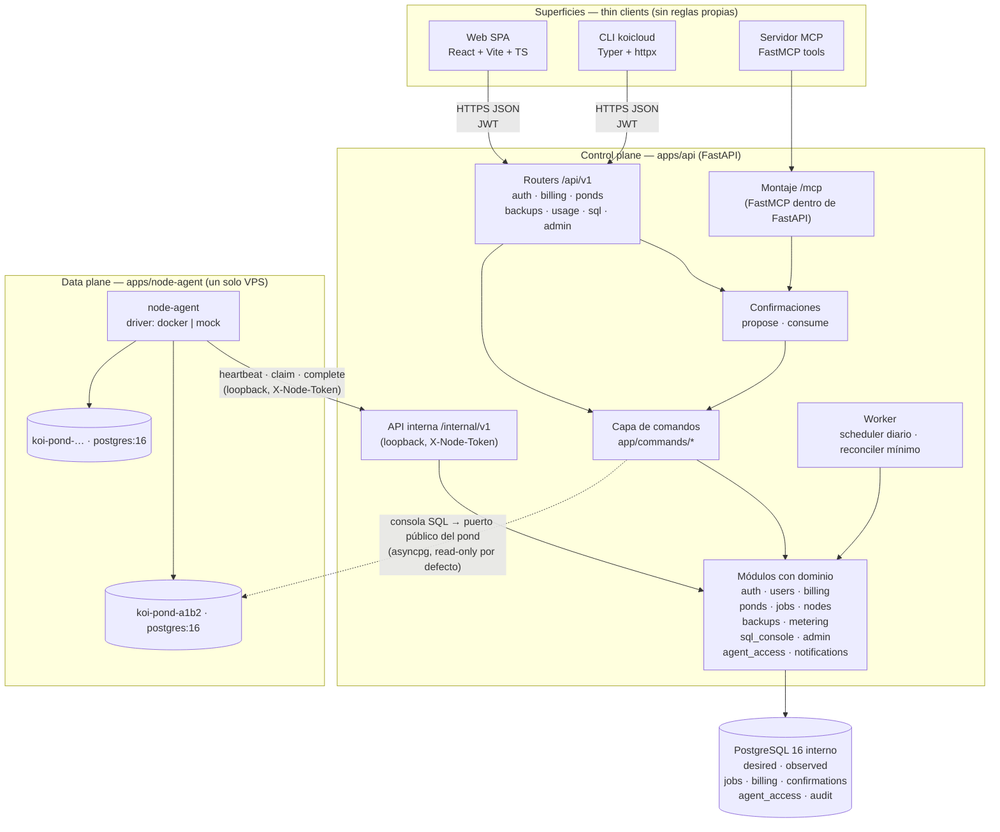
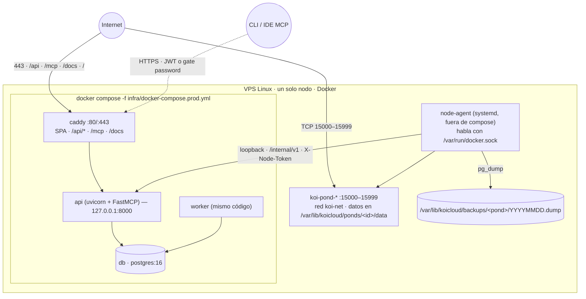
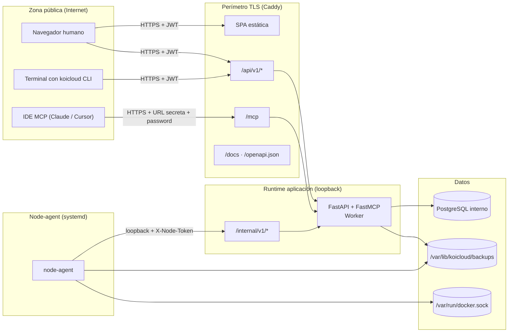

# Arquitectura del sistema

Este documento fija la topología de la plataforma: control plane, data plane, las tres superficies (Web, CLI, MCP) que consumen una sola API, el despliegue y los límites de confianza. Los flujos concretos (secuencias) están en [`interconnections.md`](./interconnections.md).

---

## 1. Principios que la arquitectura preserva

1. **Un solo cerebro:** cada regla de negocio existe **una vez**, en la capa de comandos del control plane. Los routers HTTP, las herramientas MCP y la CLI (vía HTTP) son adaptadores delgados sin reglas propias.
2. **El control plane no toca Docker.** Solo escribe estado deseado y encola jobs. Docker vive dentro del node-agent.
3. **Todo el estado vive en PostgreSQL** (estado deseado, estado observado, cola de jobs, `pending_confirmations`, auditoría mínima). Ningún proceso guarda estado significativo en memoria entre requests.
4. **Cola en la misma base**, con `FOR UPDATE SKIP LOCKED`. Sin brokers externos (evita Kafka/RabbitMQ y su operación).
5. **Un solo nodo VPS.** Multi-nodo, HA y migración de instancias son *fuera de alcance*.
6. **Mutaciones remotas requieren confirmación.** El patrón `propose → confirmation_token → confirm` aplica a toda superficie no navegador (CLI y MCP) para las operaciones catalogadas como mutantes / destructivas.
7. **Gate de agente ≠ producto de seguridad.** La URL + password del MCP endpoint es una puerta mínima para la demo; no reemplaza OAuth ni scopes. Se documenta como tal.

---

## 2. Vista de componentes



**Lectura corta:**

- Toda superficie desemboca en `commands/*`.
- `commands/*` orquesta módulos con dominio (auth, billing, ponds, jobs, etc.) que a su vez tocan la base.
- El worker corre en el mismo código, otro proceso, y dispara respaldos programados + un *reconciler* mínimo (no vendido) que reencola jobs caídos.
- El node-agent es el único que corre `docker run` / `docker rm`.
- La consola SQL abre una **conexión efímera** al puerto público del pond usando `asyncpg`, no reutiliza pools.

---

## 3. Módulos del control plane (mapa mental)

Cada módulo vive en `apps/api/app/modules/<name>/` y expone su superficie pública por `__init__.py` (nada de importar desde archivos internos). Detalle de rutas en [`repo-scaffolding.md`](./repo-scaffolding.md) §Layout de módulo.

| Grupo | Módulos | Responsabilidad |
|-------|---------|-----------------|
| Cuentas | `auth`, `users`, `notifications` | Registro, verificación, JWT+refresh, correos transaccionales (consola en dev) |
| Dinero | `billing` | Planes, suscripciones, pago simulado, facturas PDF con IVA, renovación/cancelación |
| Plataforma | `ponds`, `jobs`, `nodes`, `backups` | Estado deseado, cola con `SKIP LOCKED`, healthchecks del node-agent, respaldos diarios + restore |
| Medición y consola | `metering`, `sql_console` | Horas de instancia y almacenamiento (estimados por muestras del agente), ejecución SQL con timeout + row cap |
| Superficies especiales | `agent_access`, `admin` | Slug + password del MCP endpoint por usuario, panel administrador |
| Comandos | `app/commands/*` (transversal) | Punto único de reglas para `create_pond`, `delete_pond`, `run_sql`, `subscribe`, `cancel_subscription`, `restore_backup`, `reveal_agent_access`, `propose_action`, `confirm_action` |

**Regla férrea:** un router HTTP nunca contiene lógica; llama a un comando y traduce la respuesta a HTTP. Una herramienta MCP nunca contiene lógica; llama a un comando y traduce la respuesta a MCP. La CLI **solo** llama a la API vía `httpx`.

---

## 4. Superficies como adaptadores delgados

### 4.1 Web SPA

- Cliente principal para humanos.
- No requiere `pending_confirmations`: la propia UI ya pide confirmación local (modal “escribí el nombre del pond para eliminarlo”).
- Consume `/api/v1/*` con `openapi-fetch` + tipos generados desde el OpenAPI del control plane.

### 4.2 CLI `koicloud`

- Cliente HTTP puro, sin dominio.
- Login con `koicloud login` que escribe token en `~/.config/koicloud/config.json`.
- Toda mutación (create/delete pond, SQL write, restore backup, cancel subscription) sigue el patrón `propose → confirm`:
  1. `koicloud pond delete <name>` → API responde `409 confirmation_required` con `confirmation_token` + `summary`.
  2. CLI muestra el resumen y guía: `koicloud confirm <token>` (o `--yes <token>` para scripts).
  3. Al confirmar, la API ejecuta el comando y devuelve el resultado real.

### 4.3 Servidor MCP

- Montado dentro del proceso API con **FastMCP**. Ruta pública `/mcp` (Streamable HTTP).
- El endpoint público está protegido por **URL secreta + password** por usuario (tabla `agent_access`, ver [`data-model.md`](./data-model.md)). Se revelan/rotan desde el panel Web.
- Cada tool es de ≤ 25 líneas y llama a un comando o pide una confirmación pendiente.
- Tools comprometidas: `list_ponds`, `get_pond`, `create_pond` (propose), `delete_pond` (propose), `run_sql` (propose para write), `list_subscriptions`, `confirm_action(token)`, `whoami`.

**Los tres clientes hablan con las mismas rutas HTTP** (MCP monta el server FastMCP dentro del proceso API, así que comparte el mismo runtime y la misma capa `commands`).

---

## 5. Vista de despliegue



**Reglas de despliegue:**

- Un único dominio (`koicloud.example` — placeholder hasta que exista). Caddy termina TLS y multiplexa.
- `/internal/*` **no** se expone al exterior: Caddy responde 403 al recibirlo desde fuera del loopback; el node-agent entra por `127.0.0.1:8000/internal/v1`.
- Ponds escuchan en `15000–15999` con `--restart=no`. El reconciler mínimo puede reencolar `start_pond` si `desired=running && observed=stopped`, pero no se vende como “auto-heal”.
- Backups son archivos `.dump` en disco local del VPS; el respaldo de la propia base interna es un cron en el host (7 días de retención).
- Firewall del VPS: `22`, `80`, `443`, `15000–15999`. Ningún otro puerto.

---

## 6. Trust boundaries



**Autenticación y autorización por límite:**

| Límite | Quién puede entrar | Cómo se autentica | Autoriza |
|--------|--------------------|-------------------|----------|
| SPA (`/`) | Cualquier navegador | Cookies opcionales; auth real la impone `/api/v1/*` | — |
| `/api/v1/*` | Cliente autenticado | `Authorization: Bearer <JWT>` (15 min) + refresh (30 días, rotativo) | Rol Cliente o Administrador según ruta |
| `/mcp` | Agente/IDE del propio usuario | Gate: URL con slug secreto + `Authorization: Basic slug:password` (o `X-KOI-AGENT-PASSWORD`). Password hasheada en `agent_access` (argon2) | Ejecuta como el usuario dueño del slug; **toda mutación exige `pending_confirmations`** |
| `/internal/v1/*` | Solo node-agent | `X-Node-Token` (secreto persistido en la config del agente y en `nodes.token_hash`); además Caddy bloquea salvo loopback | Emitir heartbeat, reclamar jobs, reportar completado, subir muestras |
| Docker socket | Solo node-agent | Permisos de socket UNIX (usuario `koi-agent` en grupo `docker`) | Crear/parar/eliminar contenedores del prefijo `koi-pond-*` (validado antes de operar) |
| Pond `:15xxx` | Cualquiera con URI válida | Password aleatoria del pond (argon2/cifrado en reposo con Fernet) | Rol `koi` del pond |

**El MCP no es un canal privilegiado.** Tiene tantos derechos como el usuario dueño, pero exige confirmación extra para mutar. La CLI es equivalente (mismo JWT que la Web) pero también exige confirmación en mutaciones.

---

## 7. Topología del ciclo `desired → observed`

El corazón del control plane es la separación entre lo que el usuario **pidió** y lo que el node-agent **ve**. Este esquema resume el ciclo (secuencias detalladas en [`interconnections.md`](./interconnections.md)):

```mermaid
flowchart LR
    U((Usuario)) -->|POST /ponds| API["FastAPI"]
    API -->|commands.create_pond| DB[("ponds.desired=running<br/>pond_status.observed=pending<br/>jobs(create_pond, queued)")]
    NA["node-agent"] -->|POST /internal/jobs/claim| API
    API -->|"SELECT … FOR UPDATE SKIP LOCKED<br/>UPDATE jobs SET status=running"| DB
    API -->|payload create_pond| NA
    NA -->|docker run + pg_isready| NA
    NA -->|POST /internal/jobs/{id}/complete| API
    API -->|UPDATE jobs succeeded<br/>UPDATE pond_status.observed=running| DB
    W["worker (30 s)"] -->|reconciler mínimo:<br/>reencola job si desired≠observed<br/>y no hay job activo| DB
```

**Notas clave:**

- Un pond tiene **a lo sumo un job activo** (índice único parcial en `jobs (pond_id) WHERE status IN ('queued','running')`).
- El reconciler es un fallback interno; **no** se vende como “self-heal”. Su rol público en la demo es corregir jobs caídos por reinicio del agente, no simular caos.
- El node-agent envía **heartbeats** cada 15 s con la lista de contenedores del prefijo `koi-pond-*` y su estado observado; eso mantiene `pond_status.last_seen_at`.
- La cola vive en la misma base: escaladar decenas de jobs/minuto sobra para el aula.

---

## 8. Decisiones de arquitectura (resumen; ADRs viven en el repo de implementación)

| # | Decisión | Alternativa descartada | Por qué |
|---|----------|-----------------------|---------|
| A-01 | Monolito modular FastAPI (no microservicios) | Microservicios por dominio | Ciclo de despliegue simple; transacciones compartidas entre auth/billing/ponds; el equipo no ha operado microservicios |
| A-02 | Cola en PostgreSQL con `SKIP LOCKED` | Kafka / RabbitMQ / Redis Streams | Una dependencia menos; el orden de magnitud del aula (decenas de jobs/min) sobra; el equipo ya sabe SQL |
| A-03 | Docker directo en un VPS (no Kubernetes) | K8s / Nomad | El curso evalúa **entender** el provisioning; K8s lo esconde y añade operación que no aporta al aprendizaje |
| A-04 | Node-agent como proceso systemd separado | Ejecutar Docker desde la API | Aísla la única capa con acceso al socket; la API se puede reiniciar sin tocar contenedores |
| A-05 | Cola de confirmaciones (`pending_confirmations`) para CLI/MCP | Enviar “eres tú” en cada request | La confirmación es explícita, no depende de sesiones ni cookies, se puede expirar y auditar |
| A-06 | FastMCP montado en el mismo proceso API | Proceso MCP aparte detrás de Caddy | Menos operación, comparte contexto y logging con la API. Se documenta un plan B (proceso aparte) en ADR-013 del harness previo por si el montaje in-process presenta bugs con FastMCP `n.n` |
| A-07 | Autenticación de agente = URL secreta + password | OAuth 2.1 con scopes finos | Alcance sellado; la seguridad completa se etiqueta V2 y se documenta como tal. **No** se pretende que sea equivalente |
| A-08 | Superficies delgadas sin dominio | Duplicar reglas en cada superficie | Una sola fuente de verdad de reglas evita divergencia; hace el sistema demostrable con la misma prueba en tres canales |
| A-09 | Consola SQL con conexión efímera por consulta | Pool persistente por pond | Aísla fallos; permite `SET TRANSACTION READ ONLY` + `statement_timeout` sin manchar la conexión de otro request; el aula no exige throughput |
| A-10 | `docker --restart=no` y reconciler propio | `docker --restart=always` | El curador de estado somos nosotros; permite pausar/reiniciar sin “el sistema me lo levanta atrás” |
| A-11 | Backups como archivos en disco local | S3 / MinIO | Fuera de alcance añadir almacenamiento externo; el respaldo local es suficiente para la demo y se documenta como tal |
| A-12 | Un solo repo (monorepo) `koicloud` | Split por app | El equipo es pequeño; la coordinación de contratos entre repos añade overhead sin beneficio proporcional |

Estas decisiones son las que sostienen el resto del pack. Cualquier propuesta futura que las contradiga se convierte primero en ADR en el repo de implementación.

---

## 9. Interfaces observables (contrato con el resto del pack)

| Contrato | Documento donde vive |
|----------|----------------------|
| Rutas HTTP `/api/v1/*` y payloads | [`api-surface.md`](./api-surface.md) |
| Rutas internas `/internal/v1/*` | [`api-surface.md`](./api-surface.md) §Internal |
| Tools MCP | [`api-surface.md`](./api-surface.md) §MCP tools |
| Comandos CLI | [`api-surface.md`](./api-surface.md) §CLI |
| Tablas, enums, migraciones | [`data-model.md`](./data-model.md) |
| Flujos concretos (secuencias) | [`interconnections.md`](./interconnections.md) |
| Estructura de directorios del repo | [`repo-scaffolding.md`](./repo-scaffolding.md) |

Los diagramas Mermaid de este documento tienen fuente `.mmd` en [`diagrams/`](./diagrams/) para regenerar SVG cuando haga falta.
