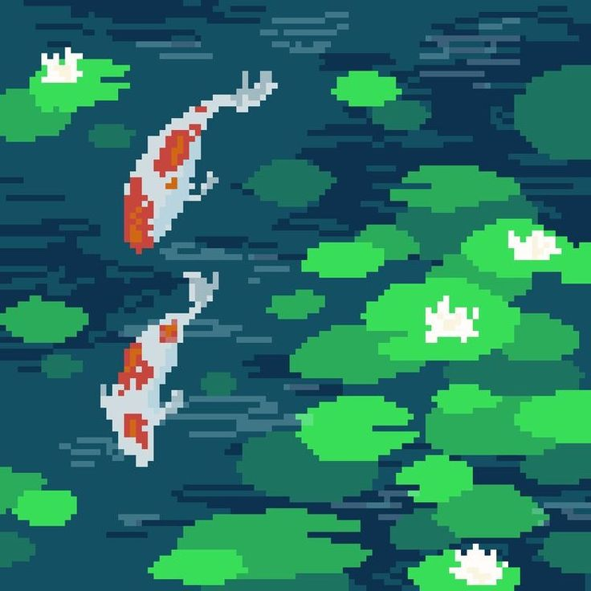
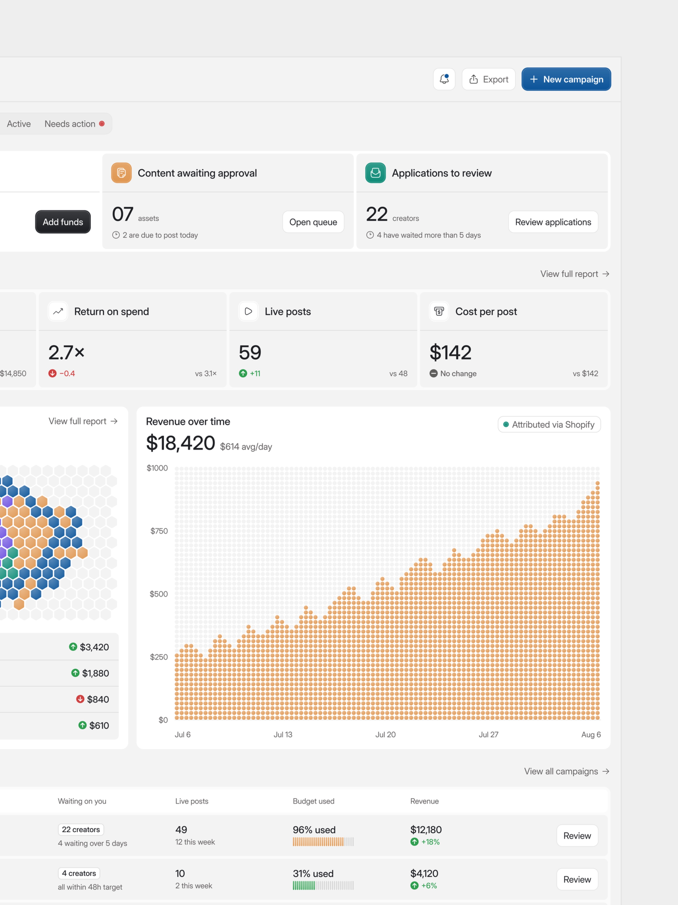
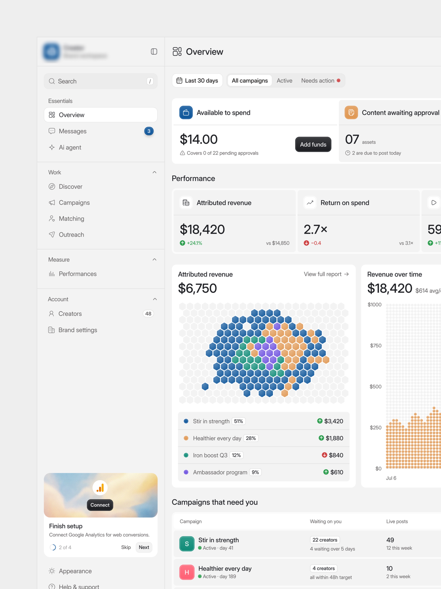
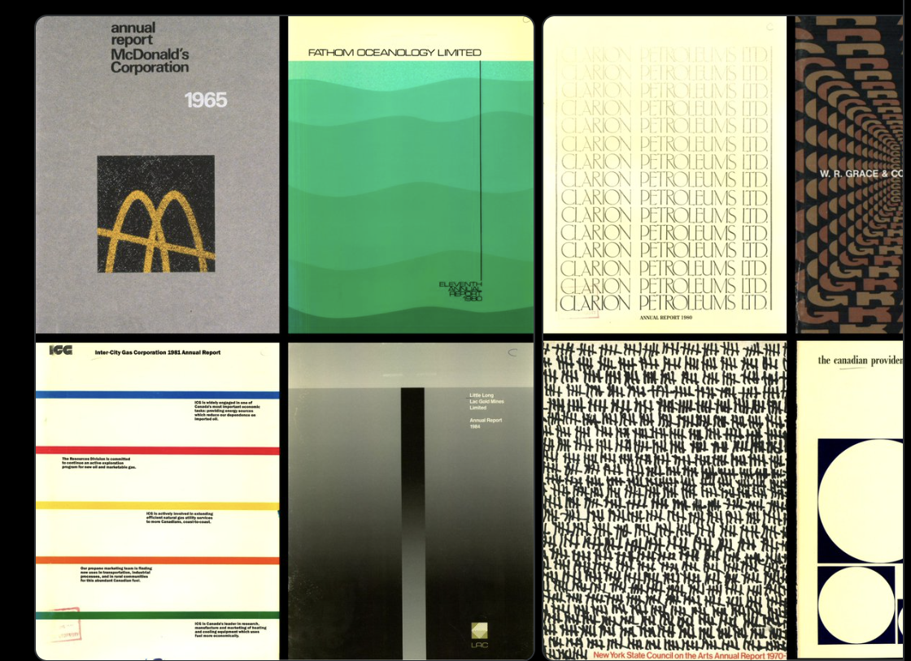
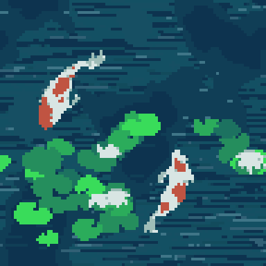

# KoiCloud — Guía visual (piel del producto web)

**Proyecto:** KoiCloud (DBaaS académico, PostgreSQL en Docker)
**Equipo KoiCloud:** Hugo Escobar · Jason Gutiérrez · Jousé Menendez · Diego Joachin
**Audiencia:** W2 (producto web) y los agentes de Cursor que escriban `apps/web/**`.
**Estado:** normativo para *apariencia*. No cambia alcance, ni contratos, ni arquitectura de información.

---

## 0. Qué manda y qué no

Este documento define **cómo se ve** KoiCloud. No redefine **qué** pantallas existen.

| Tema | Fuente de verdad |
|---|---|
| Alcance comprometido | [`entrega-2/alcance.md`](./entrega-2/alcance.md) — sellado, no se reabre aquí |
| Qué pantallas existen y qué muestran | [`entrega-2/mockups/pantallas-principales.html`](./entrega-2/mockups/pantallas-principales.html) + [`architecture/feature-breakdown.md`](./architecture/feature-breakdown.md) |
| Endpoints, estados, errores | [`architecture/api-surface.md`](./architecture/api-surface.md), [`architecture/data-model.md`](./architecture/data-model.md) |
| **Color, tipografía, espaciado, movimiento, marca** | **este documento** |

Dos supersesiones explícitas:

1. **Los mockups de Entrega 2 quedan superados como piel, no como IA de pantalla.** Su estructura (qué campos, qué tablas, qué pasos) sigue vigente y es la referencia. Su tema oscuro, su paleta y su tipografía quedan anulados por este documento.
2. **La sección de diseño del harness anterior (`W2-web.md §R4`) queda anulada.** Ese texto pide `Inter`, `#0F6E6E`, `#F26B1D` y modo oscuro por clase. Nada de eso aplica. KoiCloud es **tema claro único**: no hay dark mode en el semestre, no hay toggle de tema, no hay `.dark`. Un solo tema bien hecho vale más que dos a medias, y el presupuesto de tiempo se va a la consola SQL.

---

## 1. Norte visual

> **Un reporte anual de 1983 que resulta ser un panel de control.**
> Papel hueso, tinta casi negra, retículas duras, números grandes con orgullo, un acento turquesa que no pide permiso — y un estanque de koi en pixel art como única concesión a la ternura.

Tres adjetivos que decidimos discusiones: **impreso, denso, sereno.**

- **Impreso** — el fondo es papel, no “blanco de aplicación”. Hay hairlines, no sombras difusas. Los bordes son casi rectos. Si una pantalla podría imprimirse en offset a dos tintas y seguir viéndose intencional, vamos bien.
- **Denso** — información por pulgada alta, al estilo del panel de la referencia 02. Las tarjetas son compactas, las tablas son de 40 px de fila, los KPI viven en cuadrículas. La densidad es la prueba de que el producto hace algo.
- **Sereno** — el color se gana. El 85 % de cada pantalla es hueso + tinta + línea. Turquesa y verde estructuran; koi (naranja) es escaso y siempre significa *atención o marca*, nunca decoración.

### 1.1 Referencias

#### Ref 05 y 06 — Estanque de koi hi-bit (**norte del arte del estanque**)



`../media/visual-refs/05-koi-pond-hibit-a.png` · segunda referencia de atmósfera: `06-koi-pond-hibit-b.png`

**Tomamos:** la retícula densa (el ref A vive en 91×91 píxeles nativos, no en 32×32), el agua **azul profunda** con rayas de onda horizontales de 2 a 8 px, los koi **kohaku** — cuerpo blanco con manchas rojo-naranja y aletas gris verdoso —, los nenúfares en cuatro verdes planos agrupados en racimos, las flores blancas sobre las hojas, la vista **desde arriba** y el borde duro sin antialias.
**No tomamos:** el encuadre de ilustración completa. En el producto el estanque sigue siendo una *banda* o un *panel*, nunca un fondo bajo datos. Tampoco tomamos el ruido de compresión del ref: el arte se reconstruye en su retícula nativa y en paleta cerrada (§7.1).

**Derogado:** el antiguo Ref 01 (`../media/visual-refs/01-koi-pixel-pond.png`, koi turquesa disperso tipo punto de cruz) y el stand-in de 32×32 de `internal/koi-standin-gen.py`. Ninguno de los dos es norte de nada: el primero era escaso y de otra paleta, el segundo era un cuadro generado a mano para marcar posición en las maquetas. No los uses como referencia de arte nuevo.

#### Ref 02 — Panel SaaS denso (densidad de datos)



`../media/visual-refs/02-saas-dashboard-dense.png` · preview: `../media/visual-refs/preview/02-saas-dashboard-dense.jpg`

**Tomamos:** la rejilla de tarjetas KPI con cifra enorme + etiqueta chica + delta; el gráfico de área construido con **matriz de puntos** (traduce perfecto a nuestro pixel art); las tablas con micro-barras de progreso inline; la disciplina de “una acción primaria por región”.
**No tomamos:** el gris-azul de aplicación, las esquinas redondeadas de 12 px, las sombras suaves, el azul corporativo.

#### Ref 03 — Barra lateral limpia + mapa de celdas (navegación)



`../media/visual-refs/03-saas-sidebar-honeycomb.png` · preview: `../media/visual-refs/preview/03-saas-sidebar-honeycomb.jpg`

**Tomamos:** la lateral agrupada con encabezados de sección en minúscula pequeña; el ítem activo como bloque sólido con borde; los contadores alineados a la derecha; el bloque de onboarding al pie; y el **mapa de celdas** como idea — en KoiCloud se convierte en la *rejilla del estanque* (una celda por pond).
**No tomamos:** los avatares circulares, los degradados, el multicolor del hexágono (nuestro mapa usa la escala turquesa/verde + koi para `failed`).

#### Ref 04 — Reportes anuales de los 60–80 (alma)



`../media/visual-refs/04-80s-annual-reports.png` · preview: `../media/visual-refs/preview/04-80s-annual-reports.jpg`

**Tomamos:** el papel crema como sustrato (Clarion, ICG, “the canadian provider”); las bandas de color plano que separan secciones (ICG 1981 — literalmente nuestro separador de sección); el degradado de verdes por capas de Fathom Oceanology (nuestra escala de gráficos); el tipo grande apilado a la izquierda con mucho aire; la repetición tipográfica como textura.
**No tomamos:** el grano de impresión, las texturas fotográficas, el marrón/ocre setentero, nada nostálgico-irónico. Buscamos el **rigor** de esas piezas, no su pátina.

---

## 2. Tokens

Todo color, radio, espacio y duración viene de aquí. **Ningún hex literal en componentes.**

### 2.1 Bloque canónico (`apps/web/src/index.css`)

```css
:root {
  /* ── Sustrato: papel ───────────────────────────────────────────── */
  --bone:          #F2ECDC;  /* fondo de aplicación */
  --bone-raised:   #FBF7EC;  /* tarjetas, popovers, filas impares */
  --bone-sunk:     #E8E0CC;  /* encabezado de tabla, pistas, campos deshabilitados */
  --paper:         #FFFCF4;  /* lienzos de lectura larga: factura, resultados SQL, editor */

  /* ── Tinta ─────────────────────────────────────────────────────── */
  --ink:           #14211F;  /* texto principal, títulos */
  --ink-muted:     #4C5B58;  /* texto secundario, etiquetas, ayudas */
  --ink-faint:     #6B7A74;  /* SOLO ≥24 px o no-texto — ver §3 */

  /* ── Líneas ────────────────────────────────────────────────────── */
  --line:          #D8CFB8;  /* hairline decorativa: divisores, bordes de tarjeta */
  --line-control:  #8C8778;  /* borde de control interactivo: input, select, checkbox */

  /* ── Turquesa: estructura, marca, acción ───────────────────────── */
  --turquoise-100: #C6E9E4;
  --turquoise-300: #79CFC6;
  --turquoise-500: #0E9C8E;  /* SOLO relleno/trazo — no es color de texto */
  --turquoise-700: #0A6D64;  /* acción primaria, enlaces, foco */
  --turquoise-900: #06413C;

  /* ── Verde: salud, crecimiento, positivo ───────────────────────── */
  --green-100:     #DDEAC9;
  --green-500:     #5B9A45;  /* SOLO relleno/trazo */
  --green-700:     #376B2C;
  --green-900:     #1F4420;

  /* ── Acentos ───────────────────────────────────────────────────── */
  --koi:           #E2552B;  /* marca + atención. Escaso. No es texto <24 px */
  --koi-soft:      #F3A183;  /* fondo de badge/realce */
  --marigold:      #E3A72C;  /* fondo de badge; series de gráfico */
  --lagoon:        #5C6FB1;  /* serie de gráfico; enlace visitado */

  /* ── Semántica de estado ───────────────────────────────────────── */
  --ok:            #376B2C;
  --warn:          #8A5A0A;
  --danger:        #A81F2B;

  /* ── Tipografía ────────────────────────────────────────────────── */
  --font-display: "Fraunces", "Source Serif 4", Georgia, serif;
  --font-sans:    "Instrument Sans", "Helvetica Neue", system-ui, sans-serif;
  --font-mono:    "IBM Plex Mono", ui-monospace, SFMono-Regular, monospace;

  /* ── Espacio: base 4, ritmo 8 ──────────────────────────────────── */
  --space-1: 4px;   --space-2: 8px;   --space-3: 12px;  --space-4: 16px;
  --space-5: 24px;  --space-6: 32px;  --space-7: 48px;  --space-8: 64px;

  /* ── Radios: casi rectos ───────────────────────────────────────── */
  --radius-xs: 0px;   /* celdas de tabla, banda de sección */
  --radius-sm: 2px;   /* botones, inputs, badges, chips */
  --radius-md: 4px;   /* tarjetas, popovers, diálogos */
  --radius-lg: 6px;   /* único permitido: panel del estanque en la landing */

  /* ── Elevación: offset duro de imprenta, nunca blur suave ──────── */
  --shadow-print:   3px 3px 0 rgba(20, 33, 31, 0.10);  /* popover, dropdown */
  --shadow-dialog:  6px 6px 0 rgba(20, 33, 31, 0.14);  /* diálogo modal */
  --shadow-focus:   0 0 0 2px var(--bone), 0 0 0 4px var(--turquoise-700);

  /* ── Movimiento ────────────────────────────────────────────────── */
  --dur-instant: 80ms;   /* hover, cambio de color */
  --dur-fast:    140ms;  /* apertura de popover, expand de fila */
  --dur-slow:    240ms;  /* diálogo, panel lateral */
  --ease:        cubic-bezier(0.2, 0, 0.1, 1);
  --ease-out:    cubic-bezier(0, 0, 0.2, 1);

  /* ── Métrica del shell ─────────────────────────────────────────── */
  --sidebar-w:          264px;
  --sidebar-w-collapsed: 72px;
  --header-h:            56px;
  --content-max:       1280px;
  --row-h:               40px;
}
```

### 2.2 Puente con shadcn

W2 usa shadcn/ui. Mapea sus variables a los tokens de arriba — **no toques los hex de shadcn directamente.**

```css
:root {
  --background: var(--bone);            --foreground: var(--ink);
  --card: var(--bone-raised);           --card-foreground: var(--ink);
  --popover: var(--bone-raised);        --popover-foreground: var(--ink);
  --primary: var(--turquoise-700);      --primary-foreground: var(--bone-raised);
  --secondary: var(--bone-sunk);        --secondary-foreground: var(--ink);
  --muted: var(--bone-sunk);            --muted-foreground: var(--ink-muted);
  --accent: var(--turquoise-100);       --accent-foreground: var(--turquoise-900);
  --destructive: var(--danger);         --destructive-foreground: var(--bone-raised);
  --border: var(--line);
  --input: var(--line-control);
  --ring: var(--turquoise-700);
  --radius: var(--radius-sm);

  --chart-1: var(--turquoise-700);
  --chart-2: var(--koi);
  --chart-3: var(--green-500);
  --chart-4: var(--marigold);
  --chart-5: var(--lagoon);
}
```

Si la versión de shadcn del proyecto espera tripletas HSL sin función (`--primary: 175 83% 23%`), usa esta tabla de conversión — son los mismos colores:

| Token | Hex | HSL |
|---|---|---|
| `bone` | `#F2ECDC` | `44 46% 91%` |
| `bone-raised` | `#FBF7EC` | `44 65% 95%` |
| `bone-sunk` | `#E8E0CC` | `43 38% 85%` |
| `paper` | `#FFFCF4` | `44 100% 98%` |
| `ink` | `#14211F` | `171 25% 10%` |
| `ink-muted` | `#4C5B58` | `168 9% 33%` |
| `ink-faint` | `#6B7A74` | `156 7% 45%` |
| `line` | `#D8CFB8` | `43 29% 78%` |
| `line-control` | `#8C8778` | `45 8% 51%` |
| `turquoise-100` | `#C6E9E4` | `171 44% 85%` |
| `turquoise-300` | `#79CFC6` | `174 47% 64%` |
| `turquoise-500` | `#0E9C8E` | `174 84% 33%` |
| `turquoise-700` | `#0A6D64` | `175 83% 23%` |
| `turquoise-900` | `#06413C` | `175 83% 14%` |
| `green-100` | `#DDEAC9` | `84 44% 85%` |
| `green-500` | `#5B9A45` | `104 38% 44%` |
| `green-700` | `#376B2C` | `110 42% 30%` |
| `green-900` | `#1F4420` | `122 37% 19%` |
| `koi` | `#E2552B` | `14 76% 53%` |
| `koi-soft` | `#F3A183` | `16 82% 73%` |
| `marigold` | `#E3A72C` | `40 77% 53%` |
| `lagoon` | `#5C6FB1` | `227 35% 53%` |
| `warn` | `#8A5A0A` | `38 86% 29%` |
| `danger` | `#A81F2B` | `355 69% 39%` |

---

## 3. Contraste: reglas duras

Los ratios ya están medidos. Estas reglas no son sugerencias: tres tokens **no** son colores de texto y el equipo se equivocará con ellos si no queda escrito.

| Combinación | Ratio | Veredicto |
|---|---:|---|
| `ink` sobre `bone` | 14.05 | AAA — texto principal |
| `ink` sobre `bone-raised` / `paper` | 15.48 / 16.17 | AAA |
| `ink-muted` sobre `bone` | 6.05 | AA todo tamaño — secundario, etiquetas, ayudas |
| **`ink-faint` sobre `bone`** | **3.82** | **Falla AA en texto normal.** Solo ≥24 px, o ≥19 px negrita, o no-texto (iconos, marcas de eje) |
| `turquoise-700` sobre `bone` | 5.26 | AA — enlaces, texto de acción, anillo de foco |
| **`turquoise-500` sobre `bone`** | **2.89** | **Nunca texto.** Relleno, trazo de gráfico, barra de progreso |
| `green-700` sobre `bone` | 5.39 | AA — texto de éxito |
| `warn` sobre `bone` | 5.02 | AA — texto de advertencia |
| `danger` sobre `bone` | 6.15 | AA — texto de error |
| **`koi` sobre `bone`** | **3.20** | **Nunca texto de párrafo.** Titulares ≥24 px, iconos, trazos, el sprite |
| `lagoon` sobre `bone` | 4.08 | Solo texto grande o no-texto |
| `bone-raised` sobre `turquoise-700` | 5.80 | AA — **el botón primario** |
| `bone-raised` sobre `danger` | 6.77 | AA — botón destructivo |
| `ink` sobre `turquoise-100` | 12.77 | AAA — badge informativo |
| `ink` sobre `green-100` | 13.17 | AAA — badge de éxito |
| `ink` sobre `koi-soft` | 8.08 | AAA — badge de atención |
| `ink` sobre `marigold` | 7.76 | AAA — badge de advertencia |
| `line` sobre `bone` | 1.32 | **Decorativa.** Nunca como borde de control ni anillo de foco |
| `line-control` sobre `bone` | 3.04 | Cumple 3:1 no-texto — borde de input, checkbox, radio |

**Anillo de foco:** siempre `--shadow-focus` (2 px `bone` de separación + 2 px `turquoise-700`). Visible sobre `bone`, `bone-raised`, `bone-sunk` y `paper`. Nunca `outline: none` sin reemplazo.

**Nunca codificar significado solo por color.** Todo estado lleva texto, y los badges llevan además un glifo (`●` en línea, `◐` en proceso, `▲` atención, `✕` falla). Los gráficos llevan etiqueta directa o densidad de punto distinta, no solo tono.

---

## 4. Tipografía

Tres familias. Todas libres, autohospedadas vía Fontsource (sin CDN de Google — el VPS debe funcionar sin red externa).

| Rol | Familia | Por qué | Uso |
|---|---|---|---|
| **Display** | **Fraunces** (variable) | Serif de contraste alto con ejes `opsz`/`SOFT`/`WONK`. Da el gesto editorial del reporte anual sin caer en Playfair. | Títulos de página, cifras KPI grandes, hero, números de factura |
| **UI / cuerpo** | **Instrument Sans** | Grotesca ligeramente estrecha, ojo abierto, excelente en 13–15 px. Suiza de alma, no genérica. **No es Inter.** | Todo lo demás: navegación, tablas, formularios, botones, párrafos |
| **Mono** | **IBM Plex Mono** | Legible en tamaños chicos, distingue `0/O` y `1/l/I`, y su carácter humanista combina con Fraunces mejor que JetBrains. | SQL, cadenas de conexión, IDs, tokens, JSON, `psql`, snippets |

```bash
pnpm add @fontsource-variable/fraunces @fontsource/instrument-sans @fontsource/ibm-plex-mono
```

```ts
// src/main.tsx
import "@fontsource-variable/fraunces";
import "@fontsource/instrument-sans/400.css";
import "@fontsource/instrument-sans/500.css";
import "@fontsource/instrument-sans/600.css";
import "@fontsource/ibm-plex-mono/400.css";
import "@fontsource/ibm-plex-mono/500.css";
```

Ajuste de Fraunces para tono “reporte”, no “boda”:

```css
.font-display {
  font-family: var(--font-display);
  font-variation-settings: "SOFT" 0, "WONK" 0, "opsz" 48;
  letter-spacing: -0.02em;
}
```

### 4.1 Escala

| Token | Tamaño / interlínea | Familia | Peso | Uso |
|---|---|---|---|---|
| `display-xl` | 56 / 60 | Fraunces | 600 | Hero de landing (solo ahí) |
| `display-l` | 40 / 44 | Fraunces | 600 | Título de sección de landing; cifra KPI grande |
| `display-m` | 28 / 34 | Fraunces | 600 | Título de página (`PageHeader`) |
| `display-s` | 20 / 26 | Fraunces | 600 | Título de tarjeta, encabezado de diálogo |
| `body-l` | 16 / 24 | Instrument Sans | 400 | Párrafo de landing, texto de vacío |
| `body-m` | 14 / 20 | Instrument Sans | 400 | **Defecto de la app**: tablas, formularios, descripciones |
| `body-s` | 13 / 18 | Instrument Sans | 400 | Ayudas, metadatos, pie de tarjeta |
| `label` | 12 / 16 | Instrument Sans | 500 | Etiqueta de campo, encabezado de columna |
| `overline` | 11 / 14 | Instrument Sans | 600, `+0.08em`, VERSALITAS | Encabezado de grupo en lateral, banda de sección |
| `mono-m` | 13 / 20 | IBM Plex Mono | 400 | SQL, URI, resultados |
| `mono-s` | 12 / 18 | IBM Plex Mono | 400 | IDs, tokens, timestamps en tabla |

### 4.2 Reglas

- **Fraunces nunca por debajo de 20 px.** A 14 px pierde legibilidad y ensucia. Un título de tarjeta chico usa Instrument Sans 600, no Fraunces.
- **Cifras siempre tabulares:** `font-variant-numeric: tabular-nums` en toda tabla, KPI, precio y métrica. Las columnas de números se alinean a la derecha.
- **Dinero y bytes son mono-adyacentes:** usa Instrument Sans tabular para montos en tablas (`USD 5.00`), y IBM Plex Mono solo cuando el valor es copiable/técnico (URI, ID, tamaño en bytes crudo).
- **Un solo nivel de énfasis por bloque.** Si el título ya es Fraunces 28, el subtítulo es Instrument Sans 14 `ink-muted`. Nunca dos serifs seguidos.
- **Nada de mayúsculas gritadas** fuera de `overline` (que es versalita con tracking, otra cosa).
- Ancho de medida: 66–75 caracteres en párrafos largos (`max-width: 64ch`).

---

## 5. Retícula y layout

### 5.1 Shell de aplicación

```
┌────────────────┬──────────────────────────────────────────────────┐
│                │  header 56px · breadcrumb + acciones + usuario    │
│  sidebar 264px ├──────────────────────────────────────────────────┤
│  bone-sunk     │                                                   │
│  borde-derecho │  contenido · padding 32px · max-width 1280px      │
│  1px --line    │  grid 12 col · gutter 24px                        │
│                │                                                   │
└────────────────┴──────────────────────────────────────────────────┘
```

- **Lateral**: fondo `bone-sunk`, borde derecho 1 px `line`. Grupos con encabezado `overline` en `ink-faint` (permitido: 11 px versalita 600 es no-párrafo y va sobre `bone-sunk`, pero si dudas usa `ink-muted`). Ítem: 36 px de alto, radio 2, texto `body-m`. **Activo** = fondo `turquoise-100`, texto `turquoise-900`, barra izquierda de 3 px `turquoise-700`. **Hover** = fondo `bone`. Contadores alineados a la derecha en `label` sobre chip `bone`.
- Grupos de la lateral, en este orden: `Estanque` (Ponds, Crear pond) · `Consumo` (Uso del mes, Facturación, Planes) · `Agente` (Acceso agente) · `Cuenta` (Perfil) · y solo para rol admin: `Administración` (Usuarios, Suscripciones, Ponds, Bitácora).
- **Header**: fondo `bone`, borde inferior 1 px `line`. Izquierda: breadcrumb `body-s` en `ink-muted` con separador `/`. Derecha: acción primaria de la página + menú de usuario. **Sin toggle de tema.**
- **Colapso**: < 1024 px la lateral pasa a 72 px (solo iconos con tooltip). < 768 px se vuelve un cajón (`Sheet`) con botón hamburguesa en el header. Usable a 360 px sin scroll horizontal.

### 5.2 Banda de sección (el gesto ICG 1981)

Separador de secciones dentro de una página larga: regla de 3 px a todo el ancho + `overline` inmediatamente debajo. Rota el color entre secciones en este orden fijo: `turquoise-700` → `green-700` → `marigold` → `lagoon`. Es el guiño más directo a la referencia 04 y es barato de implementar.

```css
.section-band { border-top: 3px solid var(--turquoise-700); padding-top: var(--space-3); }
```

### 5.3 Tarjetas

Fondo `bone-raised`, borde 1 px `line`, radio 4, padding 20 px. **Sin sombra.** La jerarquía se construye con el borde y el fondo, no con elevación. Encabezado de tarjeta: `display-s` + descripción `body-s` `ink-muted`. Si la tarjeta tiene acción, va arriba a la derecha como botón `ghost`.

**Tarjeta KPI** (patrón de la ref 02): etiqueta `label` `ink-muted` arriba → cifra `display-l` Fraunces tabular → delta abajo con glifo y color (`green-700` ▲ / `danger` ▼ / `ink-muted` — sin cambio). Rejilla de 4 en escritorio, 2 en tablet, 1 en móvil.

### 5.4 Tablas

Es donde vive el producto; aquí se gana la densidad.

- Fila 40 px, padding horizontal 12 px, `body-m`. Radio 0 en celdas.
- Encabezado: fondo `bone-sunk`, texto `label` `ink-muted`, borde inferior 1 px `line-control` (no `line` — el encabezado sí necesita peso).
- Divisores de fila: 1 px `line`. **Sin zebra**: con el hueso de fondo, la zebra ensucia. Hover de fila: fondo `bone-raised`.
- Números y fechas a la derecha, tabulares. Texto e identificadores a la izquierda.
- Micro-barra de progreso inline (ref 02): 4 px de alto, fondo `bone-sunk`, relleno `turquoise-500`; pasa a `marigold` >80 %, `danger` >95 %.
- Tablas largas: encabezado pegajoso, y la consola SQL usa scroll virtual.

### 5.5 Formularios

Etiqueta arriba (`label`, `ink-muted`), campo, ayuda debajo (`body-s`, `ink-muted`), error debajo en `danger` con glifo. Input: 36 px de alto, fondo `paper`, borde 1 px `line-control`, radio 2. Foco: `--shadow-focus`, el borde pasa a `turquoise-700`. Error: borde `danger`. Deshabilitado: fondo `bone-sunk`, texto `ink-faint`, sin borde de control.

Ancho máximo de formulario 560 px. Botón primario abajo a la derecha, secundario a su izquierda, destructivo separado y a la izquierda del todo.

---

## 6. Componentes con decisión de marca

### 6.1 Botones

| Variante | Fondo | Texto | Borde | Cuándo |
|---|---|---|---|---|
| **Primario** | `turquoise-700` | `bone-raised` | — | Una por región. Crear pond, Ejecutar, Contratar |
| **Secundario** | `bone-raised` | `ink` | 1 px `line-control` | Cancelar, Volver, acciones neutras |
| **Fantasma** | transparente | `turquoise-700` | — | Acciones dentro de tarjeta/tabla |
| **Destructivo** | `danger` | `bone-raised` | — | Eliminar pond, eliminar cuenta |
| **Destructivo suave** | `bone-raised` | `danger` | 1 px `danger` | Detonante que abre el diálogo de confirmación |

Alto 36 px (`sm`: 30, `lg`: 44), radio 2, padding 16 px, `body-m` peso 500. Hover: oscurece un paso (`turquoise-700` → `turquoise-900`). Activo: sin traslación. Cargando: spinner 14 px + texto en gerundio (“Creando…”), botón deshabilitado.

**El koi no es color de botón.** Nunca un CTA naranja. El acento koi vive en la marca, el sprite, la serie de gráfico y el badge de atención.

### 6.2 Estados del pond

Del diagrama canónico [`architecture/diagrams/17-pond-state-machine.mmd`](./architecture/diagrams/17-pond-state-machine.mmd). Badge: radio 2, padding 2/8, `label`, glifo + texto. Fondo claro + `ink` (ratios ≥7.7, §3).

| Estado | Texto ES | Fondo | Glifo | Nota |
|---|---|---|---|---|
| `pending` | En cola | `bone-sunk` | `◌` | Aún sin job reclamado |
| `provisioning` | Aprovisionando… | `turquoise-100` | `◐` | **Aquí nada el koi** (§7.3). Sugerencia “~40 s” |
| `running` | En línea | `green-100` | `●` | Estado feliz |
| `restoring` | Restaurando… | `turquoise-100` | `◐` | Koi nadando |
| `stopped` | Detenido | `bone-sunk` | `■` | |
| `deleting` | Eliminando… | `koi-soft` | `◐` | |
| `deleted` | Eliminado | `bone-sunk` | `✕` | `ink-muted`, fila atenuada |
| `failed` | Con fallas | `#F6D9D9` | `✕` | Texto `danger`; el detalle muestra `last_error` |

La **suspensión es de la cuenta, no del pond** (E8-03): se comunica con un banner global `danger` en todo `/app`, no con un badge de pond.

### 6.3 Bloques de código, conexión y SQL

Fondo `paper`, borde 1 px `line`, radio 4, IBM Plex Mono 13/20, padding 16 px.

- **Cadena de conexión**: contraseña enmascarada por defecto (`••••••••`) con botón “Mostrar”. Botón copiar por campo, y copiar-todo arriba a la derecha. Al copiar: el icono cambia a ✓ `green-700` 1.2 s + toast. Nunca imprimas la contraseña en el DOM antes de que el usuario pulse Mostrar.
- **Resaltado SQL** (CodeMirror, E5-01): palabra clave `turquoise-700` 500 · cadena `green-700` · número `lagoon` · comentario `ink-faint` cursiva · función `ink` 500 · identificador `ink`. Fondo del editor `paper`, gutter `bone-sunk` con números en `ink-faint`, línea activa `bone`, selección `turquoise-100`.
- **Modo escritura** (E5-04): al cambiar de Lectura a Escritura, el borde del editor pasa a 2 px `koi` y aparece una banda superior `koi-soft` con texto `ink`: “Modo escritura: las sentencias modifican datos reales.” Es el único lugar de la app donde el koi rodea una región completa — y es a propósito.
- **Resultados**: tabla densa (§5.4) sobre `paper`. `NULL` en `ink-faint` cursiva. Truncado: pie “Mostrando 1000 de N filas” en `warn`. Duración y conteo en la barra de estado en mono-s.

### 6.4 Gráficos (E7-03, uso mensual)

Recharts, pero con la traducción de las referencias 02 y 04:

- **Área/tendencia → matriz de puntos.** Un punto de 3 px cada 4 px en vez de relleno sólido. Es literalmente la ref 02 y rima con el pixel art del koi. Serie principal `turquoise-700`; superpuesta `koi`.
- **Barras apiladas de uso diario**: escala de la ref 04 (Fathom), de abajo a arriba `turquoise-900` → `turquoise-700` → `turquoise-500` → `turquoise-300`. Barras rectas, sin radio, con 2 px de separación.
- **Rejilla del estanque** (traducción del hexágono de la ref 03): una celda cuadrada de 14 px por pond en la tarjeta de resumen, coloreada por estado según §6.2. Da una vista de flota legible de un vistazo sin construir el panel de flota (que está fuera de alcance).
- Ejes: línea `line`, marcas y etiquetas `ink-faint` 11 px (no-texto/pequeño permitido en marcas de eje), sin rejilla vertical, rejilla horizontal punteada 1 px `line`.
- Tooltip: `bone-raised`, borde 1 px `line-control`, `--shadow-print`, valores tabulares.
- **Toda serie lleva etiqueta directa o leyenda con glifo**, nunca solo color.

### 6.5 Diálogos, toasts, estados de datos

- **Diálogo**: `bone-raised`, borde 1 px `line-control`, radio 4, `--shadow-dialog`. Velo `rgba(20,33,31,0.32)`. Título `display-s`. Confirmación destructiva: exige escribir el nombre del recurso (contrato `confirm_name`), el nombre esperado se muestra en mono seleccionable.
- **Diálogo de confirmación `propose → confirm`** (E9-04): es la joya de la demo, trátalo como tal. Encabezado con banda `marigold`, el `summary` humano del backend en `body-l`, el token en mono-s, y la expiración como cuenta regresiva mm:ss en `warn`. Botones: “Confirmar” primario, “Descartar” secundario.
- **Toast** (`sonner`): `bone-raised`, borde izquierdo 3 px del color semántico, `--shadow-print`, radio 2, sin iconos de colores saturados.
- **Cargando**: skeletons en `bone-sunk` con barrido `bone-raised` de 1.2 s. Nunca spinners de página completa — salvo el arranque de sesión, que muestra el estanque quieto.
- **Vacío**: koi único nadando (§7.3), título `display-s`, explicación `body-m` `ink-muted`, un CTA primario. Nunca un vacío sin salida.
- **Error**: banda `danger` 3 px, mensaje traducido (`problemToMessage`), botón “Reintentar” secundario, y el `code` crudo en mono-s `ink-faint` para que el equipo pueda depurar.

---

## 7. El koi

La única pieza emocional del producto. Funciona porque todo lo demás es severo.

> **Nota de versión.** El estanque subió de resolución. Todo lo que decía «sprite de 32×32
> con 8 colores turquesa» quedó derogado: el arte ahora es **hi-bit**, en retícula densa y
> paleta azul profunda, siguiendo los refs 05 y 06 (§1.1). El stand-in de maqueta
> (`internal/koi-standin-gen.py`) ya no se usa en ninguna parte.

### 7.0 Paleta del estanque (cerrada, 14 colores)

El estanque es **ilustración**, no cromo de aplicación: tiene su propia paleta y **no** se
mezcla con los tokens de §2. La interfaz sigue siendo hueso + tinta + turquesa; el agua del
estanque es azul profunda como en los refs. Estos 14 colores son todo lo que existe dentro
del arte, y ningún componente puede usarlos como color de UI.

| Familia | Colores |
|---|---|
| Agua, de profunda a somera | `#0D334F` `#103E56` `#124B5C` `#135063` `#164F63` |
| Onda y espuma | `#316075` `#3F7587` |
| Nenúfares, de oscuro a iluminado | `#1C7260` `#258E5D` `#2BAC5B` `#39DC5A` |
| Koi y flores | `#9FBDB8` (aletas y sombra) `#D8E5E3` (cuerpo, pétalos) `#C05442` (mancha kohaku) |

El acento `--koi` `#E2552B` de §2.1 sigue siendo el naranja **de la interfaz** (badge de
atención, serie de gráfico, modo escritura). El rojo del pez ilustrado es `#C05442` y vive
solo dentro del arte. No unifiques los dos: uno tiene que pasar contraste sobre hueso, el
otro tiene que verse bien sobre navy.

### 7.1 Especificación del arte

**Retícula y escala.** El arte del estanque se dibuja a **1 píxel nativo por cada 4 px CSS**
y se muestra con `image-rendering: pixelated`. Un panel de 320 px de alto es una plancha de
80 píxeles nativos. Reglas duras:

- **Escalado solo en enteros** (×1, ×2, ×3, ×4). Un estanque a ×2.5 es un bug visual, igual
  que antes.
- **Resolución mínima**: un panel del estanque no se dibuja con menos de **30 píxeles nativos
  de alto**. El más chico es el arranque de sesión: 160×120 px CSS, es decir 40×30 nativos. La
  tira de `provisioning` (48×16) es la única excepción, y por eso lleva un solo koi y
  nenúfares chicos. Por debajo de eso el estanque deja de leerse: usa la marca.
- **Nada de reescalar hacia abajo**: para tamaños chicos existen piezas propias
  (`koi-mark-32`, `koi-mark-16`), no una reducción del sprite grande.
- **Nada de antialias, degradados CSS, opacidad ni sombra** sobre el arte.

**Koi: hoja de sprites de 64×64.** `public/koi/koi-sheet.png` — 12 cuadros de 64×64 en una
tira de 768×64: **cuadros 0–7 el ciclo de nado**, **cuadros 8–11 el giro** (el cuerpo se
acorta en perspectiva antes de que el `scaleX(-1)` cambie el rumbo). El koi es kohaku:
cuerpo `#D8E5E3`, tres manchas `#C05442` (gorro, silla, raíz de la cola), aletas y cola
`#9FBDB8`, ojo `#0D334F`. **Sin contorno**: el agua navy ya separa la silueta. A ×1 el koi
mide 64 px en pantalla, que es exactamente lo que medía el viejo sprite de 32×32 a ×2 — el
tamaño en pantalla no cambió, cambió el detalle. Nada de SVG con filtros ni de Lottie: el
pixel art se anima con `steps()`.

**Agua, nenúfares y flores: planchas teselables.** El agua no se dibuja con CSS. Son PNG
nativos que **teselan en los dos ejes** (`background-repeat: repeat`), con los nenúfares y
las flores ya dentro del arte:

| Plancha | Nativo | En pantalla (×4) | Dónde |
|---|---|---|---|
| `pond-water-hero` | 120×80 | 480×320 | landing, hero |
| `pond-water-auth` | 100×130 | 400×520 | columna de auth |
| `pond-water-panel` | 80×50 | 320×200 | vacío, arranque, 404 |
| `pond-water-strip` | 48×16 | 192×64 | tira de `provisioning` / `restoring` |

**Marca.** `koi-mark-32` (32×32) para el logotipo junto a “KoiCloud” en Fraunces 600, y
`koi-mark-16` (16×16) para el favicon. Las dos llevan **contorno de 1 px `#0D334F`**: sobre
papel hueso el cuerpo `#D8E5E3` del koi se pierde sin él. Es la única pieza del estanque con
contorno, y es a propósito.

**Piezas para componer.** Si W2 necesita un estanque dinámico (por ejemplo un koi por pond),
hay atlas: `lily-atlas-16` (10 nenúfares en celdas de 16×16), `flower-atlas-10` (4 flores) y
`koi-diagonal-atlas-32` (los dos koi diagonales del ref, para escenas quietas). Los
nenúfares se **espejean**, nunca se rotan, y no se colocan encima de un koi: en el ref los
peces nadan en agua abierta.

Así se ve el arte producido (escena cuadrada de 96×96 nativos, aquí a ×4):



`media/koi/pond-scene-square.png` · las otras dos ilustraciones completas son
`pond-scene-wide.png` (320×80, banda) y `pond-scene-panel.png` (80×50). Sirven para
documentos y presentaciones; el producto usa las planchas + la hoja de sprites.

**Origen y regeneración.** Todo el arte sale de `../media/visual-refs/05-koi-pond-hibit-a.png`
mediante `internal/koi-hibit-gen.py`, que devuelve el ref a su retícula nativa (91×91),
lo cuantiza a la paleta de §7.0, y de ahí teje el agua y recorta koi y flores. Es
determinista: misma semilla, mismos PNG. Los assets viven en `media/koi/` (y su `preview/`
a ×4 para mirarlos), y las cuatro planchas + hoja + marca están copiadas en
`docs/entrega-2/mockups/assets/`, que es lo que consumen las maquetas.

### 7.2 Agua

El agua es azul profunda, no turquesa: cinco pasos de `#0D334F` a `#164F63`, rayas de onda
horizontales de 2 a 8 px en `#316075` y `#3F7587`, y **masas de profundidad** — manchas
irregulares grandes donde el agua se oscurece dos pasos. Esa es la estructura del ref 05 y
la que reproduce el generador; no la reinterpretes con degradados.

Movimiento: la plancha se desplaza en horizontal **exactamente el ancho de un mosaico** por
ciclo (`background-position-x: -480px` para el hero), 72–110 s, lineal e infinito. Al
coincidir el desplazamiento con el mosaico, el bucle no tiene salto. Eso es todo el
movimiento del agua: nada de olas animadas ni de parpadeos de brillo.

### 7.3 Dónde aparece y dónde no

| Lugar | Forma | Movimiento |
|---|---|---|
| Landing, hero | Panel del estanque de 100 % × 320 px bajo el titular | 3 koi (uno a ×2), deriva completa 24–30 s; agua en paneo de 72 s |
| Auth (registro/login/verificar) | Panel izquierdo de 40 % de alto completo | 1 koi a ×2, deriva 30 s; agua en paneo de 110 s |
| Estado vacío | Estanque de 240×160 centrado sobre la tarjeta | 1 koi, deriva 18 s |
| `provisioning` / `restoring` | Koi de 64×64 nadando en una tira de **192×64** dentro de la tarjeta del pond | Nado de izquierda a derecha, 4.5 s, bucle |
| Arranque de sesión | Estanque quieto de 160×120 | Solo el ciclo de nado, sin deriva |
| 404 | Estanque de 320×200, koi a ×2 mirando al borde | Deriva 20 s |
| Favicon / logo | `koi-mark-16` / `koi-mark-32`, estáticos | Ninguno |

**Prohibido:** koi detrás de datos, texto o tablas · más de una instancia de estanque por pantalla · koi dentro del panel de administración, la consola SQL, la facturación o cualquier tabla · koi como indicador de estado real (es decoración de estado, el badge es la verdad) · koi rotado, con opacidad, con sombra o con degradado CSS encima.

### 7.4 Movimiento del koi

```css
/* 8 cuadros de nado × 64 px = 512; los 4 de giro quedan fuera del ciclo. */
@keyframes koi-swim    { to { background-position-x: -512px; } }
@keyframes koi-swim-x2 { to { background-position-x: -1024px; } }
@keyframes koi-drift   { /* trayectoria de deriva, translate + scaleX(-1) en el giro */ }

.koi {
  width: 64px; height: 64px;
  background: url("/koi/koi-sheet.png") 0 0 / 768px 64px;
  image-rendering: pixelated;
  animation: koi-swim 0.8s steps(8) infinite, koi-drift 26s var(--ease) infinite;
}
.koi--x2 {
  width: 128px; height: 128px; background-size: 1536px 128px;
  animation-name: koi-swim-x2, koi-drift;   /* el ×2 necesita su propio recorrido */
}
```

- Ciclo de nado **10–12 fps** (`steps(8)` en 0.66–0.8 s). Más rápido parece nervioso; más lento parece roto.
- **Cada escala necesita su propio `@keyframes`.** `background-position-x` va en píxeles, así que un koi a ×2 recorre 1024 px, no 512. Reutilizar el keyframe de ×1 desalinea la tira a media animación.
- La deriva nunca es lineal: curvas de Bézier, pausas, y un giro con `scaleX(-1)` en los extremos. Cuando el giro se vea burdo, ahí entran los cuadros 8–11 de la hoja.
- Varias instancias: desfasa con `animation-delay` negativo distinto por koi. Que naden sincronizados arruina el efecto.
- Los koi nadan en agua abierta: al colocarlos, evita que caigan sobre un nenúfar de la plancha. Las posiciones libres de cada plancha se sacan del arte, no a ojo.

### 7.5 Movimiento reducido

```css
@media (prefers-reduced-motion: reduce) {
  .koi { animation: none; background-position-x: 0; }
  .pond-water { animation: none; }
  *, *::before, *::after {
    animation-duration: 0.01ms !important;
    transition-duration: 0.01ms !important;
  }
}
```

El estanque queda como una ilustración estática y perfectamente presentable. Esto es requisito de accesibilidad, no un extra.

---

## 8. Movimiento general (fuera del koi)

La interfaz de datos es **casi inmóvil**. Un reporte impreso no se mueve.

- Hover y cambios de color: `--dur-instant` (80 ms).
- Popover, dropdown, expansión de fila: `--dur-fast` (140 ms), `--ease-out`, solo opacidad + 4 px de desplazamiento.
- Diálogo y cajón lateral: `--dur-slow` (240 ms).
- Polling de estado: cuando una fila cambia de estado, un destello de 600 ms del fondo de la fila hacia `turquoise-100` y de vuelta. Nada más. **Nunca** reordenes la tabla sola.
- **Prohibido:** parallax, animación al hacer scroll, rebote, contadores animados, transiciones de página, skeletons que pulsan más rápido de 1.2 s, spinners de página completa.

---

## 9. Sí / No

**Sí**

- Hueso de fondo en todo `/app`; `paper` solo para lienzos de lectura (factura, resultados SQL, editor, bloques de código).
- Hairlines y bandas de color plano para estructurar.
- Cifras grandes en Fraunces, tabulares, con etiqueta chica arriba.
- Una sola acción primaria visible por región.
- Densidad: preferir la tabla compacta sobre la tarjeta aireada.
- Español neutro, tuteo, “el pond”, “tu pond”; frases cortas; sin jerga sin traducir.
- Todo listado con sus tres estados: cargando, vacío con CTA, error con reintentar.

**No**

- **Inter, Roboto, Arial, Helvetica como fuente de UI.** Instrument Sans es la de UI, punto.
- Modo oscuro, toggle de tema, clase `.dark`, o los colores `#0F6E6E` / `#F26B1D` del harness anterior.
- Sombras suaves difusas, glassmorphism, degradados en superficies, bordes de 12 px.
- Koi naranja como color de botón, de enlace o de texto pequeño.
- Turquesa-500 o koi como color de texto de párrafo (§3).
- Emoji en la interfaz. Los glifos de estado son caracteres geométricos, y los iconos vienen de un solo set (`lucide`, trazo 1.5 px, 16 px en línea / 20 px en botones).
- Ilustraciones vectoriales genéricas de stock. La única ilustración de KoiCloud es el pixel art.
- Escalar el pixel art a valores no enteros o aplicarle antialias.
- Dos familias serif juntas, o Fraunces por debajo de 20 px.
- Zebra en tablas, bordes dobles, o más de dos pesos de línea en una misma vista.

---

## 10. Mapa de pantallas W2

Pantallas del alcance sellado ([`entrega-2/mockups/pantallas-principales.html`](./entrega-2/mockups/pantallas-principales.html) + épicas E1–E9). La columna de la derecha es la decisión de piel: la estructura no cambia.

| # | Pantalla | Épica | Decisión visual |
|---|---|---|---|
| 0 | **Landing pública** | E2-01 | Hero Fraunces 56 px a la izquierda + panel del estanque de 320 px debajo. Planes en 3 tarjetas con banda superior de color (turquesa/verde/marigold), Micro destacado con borde 2 px `turquoise-700`. Sección “Cómo funciona” con bandas ICG. |
| 1 | **Registro / Verificar / Login / Restablecer** | E1-01…04 | Dos columnas: 40 % panel de estanque, 60 % formulario sobre `bone`, máx. 400 px, centrado vertical. Logo koi arriba. Un solo primario. |
| 2 | **Catálogo de planes + checkout** | E2-01, E2-02 | Tabla comparativa densa (§5.4) además de las tarjetas. Diálogo de checkout con aviso `marigold` fijo: “Pago simulado: no se realiza ningún cobro real.” Número de tarjeta en mono. |
| 3 | **Dashboard de ponds** | E3-02 | Fila de 4 KPI (ponds activos, plan, uso del mes, próximo corte) → rejilla del estanque (§6.4) → tabla de ponds con badge, host:puerto en mono-s, creado hace, y acción. Vacío = estanque + “Crea tu primer pond”. |
| 4 | **Crear pond** | E3-01 | Diálogo sobre el dashboard, 560 px. Validación de nombre en vivo con eco en mono. Plan heredado como dato de solo lectura. Al enviar, redirige al detalle con el koi nadando. |
| 5 | **Detalle del pond** | E3-03/05 | `PageHeader` con nombre en Fraunces 28 + badge + acciones. Pestañas: Resumen · Conexión · Consola · Respaldos · Uso · Configuración. Resumen = KPI de límites con micro-barras. |
| 5b | **Conexión** | E3-03 | Bloque `paper` con URI enmascarada, copiar por campo, y pestañas de snippet (`psql`, `.env`, Node, Python) en IBM Plex Mono (§6.3). |
| 6 | **Consola SQL** | E5-01…05 | El lienzo más grande de la app. Editor `paper` a la izquierda, árbol de esquema colapsable a la izquierda del editor, resultados abajo con scroll virtual. Modo escritura = borde koi 2 px + banda (§6.3). |
| 7 | **Respaldos** | E6-01…04 | Tabla densa: tipo, estado, tamaño, fecha, expira. “Restaurar” abre confirmación con nombre escrito. Pre-delete marcado con chip `bone-sunk`. |
| 8 | **Uso del mes y facturación** | E7-03, E2-03 | Aquí manda el reporte anual: 3 KPI Fraunces, gráfico de matriz de puntos por día, barras apiladas turquesas por pond, tabla de desglose. Factura en lienzo `paper` con IVA desglosado, lista para imprimir. |
| 9 | **Panel administrador** | E8-01…04 | Sin adornos: tablas densas con filtros arriba, cero koi. Suspender/reactivar con confirmación. Bitácora en mono-s con banda de sección por día. |
| 10 | **Acceso agente** | E9-05 | Tarjeta con la URL `/mcp` en mono copiable, contraseña visible una sola vez sobre banda `marigold`, y pestañas de conexión (Claude Code, Cursor, genérico) con el snippet listo. |
| 11 | **Confirmación propose → confirm** | E9-04 | Diálogo con banda `marigold`, `summary` humano grande, token en mono, cuenta regresiva (§6.5). También es la pantalla que se proyecta en la demo. |
| 12 | **Cuenta** | E1-05 | Formulario de 560 px: nombre, NIT (ayuda “CF si no tienes NIT”), cambio de contraseña, eliminar cuenta con `confirm_email`. **Sin toggle de tema.** |
| — | **404** | — | Estanque de 320×200, “Esta parte del estanque está vacía”, CTA al dashboard. |

Pantallas del harness anterior que **no** se construyen (fuera del alcance sellado): página pública de estado, panel de flota, sandbox sin registro, explorador de costos avanzado, llaves de agente con scopes y topes, bandeja de aprobaciones.

---

## 11. Implementación

### 11.1 Orden de trabajo sugerido para W2

1. `src/index.css` — tokens de §2.1 + puente shadcn de §2.2, y borrar el tema por defecto de shadcn.
2. Fuentes: instalar Fontsource, importar en `main.tsx`, mapear `theme.fontFamily` de Tailwind a los tokens.
3. `tailwind.config.ts` — extender `colors`, `spacing`, `borderRadius`, `boxShadow`, `fontSize` desde las variables CSS. Ninguna utilidad de color arbitraria (`bg-[#...]`) pasa revisión.
4. Shell: `AppLayout`, `Sidebar`, `Header`, `PageHeader` (§5.1).
5. Primitivas: `Button`, `Input`, `Card`, `Table`, `Badge`, `PondStatusBadge`, `DataState`, `CodeBlock`, `CopyButton`, `SectionBand`.
6. Koi: copia los PNG de `media/koi/` a `public/koi/` (`koi-sheet-64.png` → `koi-sheet.png`, las cuatro planchas de agua, las dos marcas), y arma `<Koi/>` y `<Pond size="hero|auth|panel|strip"/>` con `prefers-reduced-motion`. Nada de regenerar el arte desde cero: ya está hecho (§7.1).
7. Recién entonces, pantallas.

### 11.2 Lista de verificación (por PR de W2)

- [ ] Cero hex literales fuera de `index.css`; cero `bg-[#…]` / `text-[#…]`.
- [ ] Ninguna clase `dark:`, ningún `.dark`, ningún toggle de tema.
- [ ] Fuente de UI = Instrument Sans. Búsqueda de `Inter` en el diff: sin resultados.
- [ ] Fraunces solo a ≥20 px.
- [ ] Toda cifra en tabla o KPI con `tabular-nums` y alineada a la derecha.
- [ ] Foco visible con `--shadow-focus` en todo elemento interactivo; recorrido por teclado completo.
- [ ] Ningún estado comunicado solo por color (texto + glifo).
- [ ] `turquoise-500`, `koi`, `ink-faint` y `lagoon` no se usan como texto de párrafo.
- [ ] Los tres estados de datos (cargando / vacío / error) presentes en cada listado.
- [ ] Máximo un estanque por pantalla; ningún koi sobre datos.
- [ ] El arte del estanque sale de `media/koi/`, a escala entera y con `image-rendering: pixelated`; ningún panel del estanque por debajo de 40 píxeles nativos de alto (§7.1).
- [ ] Los 14 colores del estanque (§7.0) no aparecen como color de UI, y `--koi` no aparece dentro del arte.
- [ ] Usable a 360 px sin scroll horizontal.
- [ ] Lighthouse accesibilidad ≥ 90 en `/`, `/app`, `/app/ponds/:id`.

---

## 12. Índice de referencias

| Ref | Ruta absoluta | Preview |
|---|---|---|
| **05 · Koi pond hi-bit A** (norte del estanque) | `../media/visual-refs/05-koi-pond-hibit-a.png` | — |
| **06 · Koi pond hi-bit B** (atmósfera) | `../media/visual-refs/06-koi-pond-hibit-b.png` | — |
| ~~01 · Koi pixel pond~~ · **derogado** por 05/06 | `../media/visual-refs/01-koi-pixel-pond.png` | `../media/visual-refs/preview/01-koi-pixel-pond.jpg` |
| 02 · SaaS dashboard denso | `../media/visual-refs/02-saas-dashboard-dense.png` | `../media/visual-refs/preview/02-saas-dashboard-dense.jpg` |
| 03 · Sidebar + honeycomb | `../media/visual-refs/03-saas-sidebar-honeycomb.png` | `../media/visual-refs/preview/03-saas-sidebar-honeycomb.jpg` |
| 04 · Reportes anuales 80s | `../media/visual-refs/04-80s-annual-reports.png` | `../media/visual-refs/preview/04-80s-annual-reports.jpg` |

Arte del estanque ya producido a partir de 05: `media/koi/` (nativo + `preview/` a ×4), copia
para maquetas en `docs/entrega-2/mockups/assets/`, generador en `internal/koi-hibit-gen.py`.

Bloque listo para pegar en un agente de Cursor: [`visual-guidelines-agent-prompt.md`](./visual-guidelines-agent-prompt.md).
